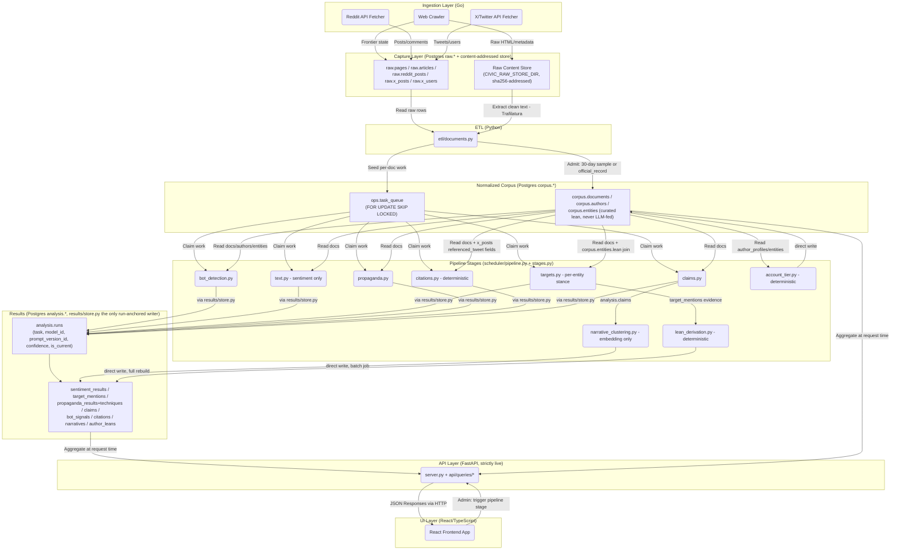

# Civic Lens Architecture and Data Flow

This document illustrates the data flow and architectural layers of the Civic Lens application, Postgres-era (post pg-redesign cutover).

Civic Lens measures **sampled political discourse** across news, Reddit, and X, with a **narrative overlay** (embedding-based claim-cluster view) and a **partial citation overlay** between owned sources. See `CLAUDE.md` and `docs/audit-trail/` for the scoping rationale.

## Data Flow Description

1. **Ingestion (Go)**: Crawlers fetch data concurrently using a job-queue model (the `raw.pages` frontier). Raw payloads are saved to the content-addressed store (`CIVIC_RAW_STORE_DIR`, SHA-256 keyed). Structured metadata (URLs, post ids, timestamps, engagement counts) is written to `raw.*` Postgres tables — a near-1:1 port of the old ingestion schema, deliberately not redesigned.
2. **ETL (Python)**: `etl/documents.py` reads `raw.*` rows, checks admission (ordinary docs need the ~30-day recency window; a tracked active official's X post is admitted regardless of age, labeled `admission_class = 'official_record'`), extracts clean text from the raw store (Trafilatura for news), and writes `corpus.documents` plus its subtype tables (`corpus.news_articles`/`reddit_posts`/`x_posts`). It also seeds one `ops.task_queue` row per doc per applicable stage.
3. **Pipeline (Python)**: `scheduler/pipeline.py` runs stages in `STAGE_ORDER` (`etl, account_tier, bot, text, targets, propaganda, citations, claims, bot_rollup, narratives, leans`); `scheduler/stages.py` claims `ops.task_queue` rows per stage with `FOR UPDATE SKIP LOCKED` and dispatches worker threads (`CIVIC_ANALYZE_CONCURRENCY`). Engines:
   - `bot_detection.py` — deterministic stylometric/account signal battery feeds an LLM call; a successful classification is `hybrid`.
   - `text.py` — sentiment only (favorability retired); a single LLM call per doc.
   - `targets.py` — per-entity stance (`target_mentions`), resolved against `corpus.entities`; this is where party stance now lives (joined to `corpus.entities.lean` at read time, never fed into the prompt).
   - `propaganda.py` — LLM-detected rhetorical techniques, evidence-validated.
   - `citations.py` — deterministic: URL mentions in text plus X reply/quote/retweet edges snapshotted onto `corpus.x_posts` at ETL time.
   - `claims.py` — LLM claim extraction with evidence-span verification; a claim whose span isn't a verbatim substring is dropped entirely.
   - `narrative_clustering.py` — embedding-only clustering of current claims into narratives; requires `CIVIC_NARRATIVE_EMBEDDING_MODEL` and fails loud if the backend can't embed.
   - `lean_derivation.py` — deterministic; pools directional `target_mentions` evidence into `analysis.author_leans`/`narrative_leans`, full rebuild per invocation.
   - `account_tier.py` — deterministic; classifies authors against the curated `corpus.entities` registry.
4. **Results (Postgres `analysis.*`)**: `results/store.py` is the sole writer of run-anchored typed result tables — every engine's `process()` opens a run, accumulates typed rows, and commits both in one transaction (`analysis.runs` plus its `sentiment_results`/`target_mentions`/etc.). `author_bot_scores` (rollup) and the narrative tables are the two documented exceptions, written directly by their computing module in a batch, not per-run.
5. **API (FastAPI, strictly live)**: `api/queries/` aggregates `corpus.*`/`analysis.*` directly at request time — there is no cache layer. `GET /snapshot-status` reads `ops.pipeline_runs` for freshness.
6. **UI (React)**: The React frontend queries the FastAPI endpoints under `/api/v1`.
