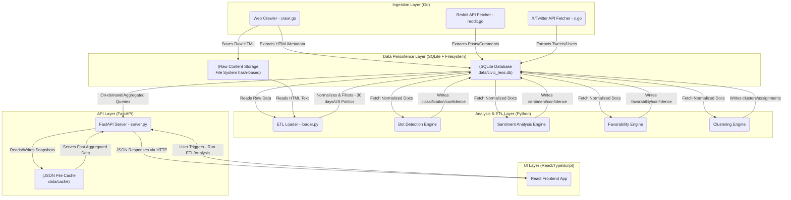

# Civic Lens Architecture and Data Flow

This document illustrates the data flow and architectural layers of the Civic Lens application.

## Data Flow Description

1. **Ingestion (Go):** The Go crawlers fetch data concurrently using a job-queue model (Frontier). The raw HTML payload is saved directly to the file system using a SHA-256 hash address for optimal storage (`data/raw/sha256/`). Structured metadata (URLs, post ids, timestamps) are pushed into the centralized SQLite database.
2. **Persistence (SQLite & FS):** The SQLite database relies on WAL mode (`_journal=WAL`) to allow concurrent reads while a single writer operates. 
3. **ETL (Python):** `loader.py` retrieves the raw db records, checks recency (last 30 days) and domain relevance (US politics constraints), fetches the corresponding raw HTML from the filesystem to extract clean text (using Trafilatura), and stores it into the unified `docs` table.
4. **Analysis (Python):** Python engines iteratively pull unprocessed `docs`, send them through local heuristic or LLM models (e.g., Bot detection, Sentiment analysis, etc.) and write the results back to the `ai_outputs` and `clusters` tables.
5. **API & Aggregation:** FastAPI serves the aggregated reporting metrics. To avoid heavy recalculations during reads, it aggressively caches the JSON output into a `data/cache` filesystem structure for fast API serving.
6. **UI (React):** The React frontend queries the FastAPI endpoints.
