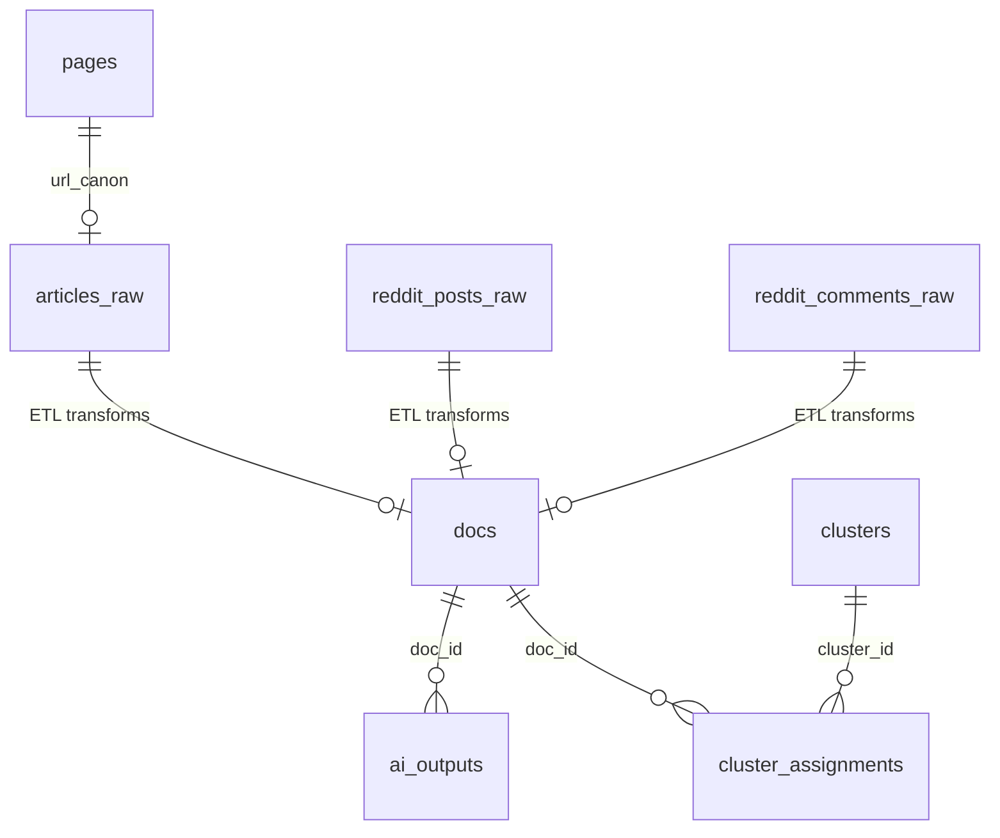

# Civic Lens Database Schema Reference

> **Version**: 1.0  
> **Last Updated**: 2026-01-23

---

## Overview

Civic Lens uses SQLite with a unified schema covering both ingestion (Go) and analysis (Python) pipelines. All tables are defined in [001_initial.sql](file:///c:/Users/kobey/civic-lens/data/migrations/001_initial.sql).

---

## Ingestion Tables

### pages (Frontier)

Tracks URL crawl state for the web crawler.

| Column | Type | Description |
|--------|------|-------------|
| `url_canon` | TEXT PRIMARY KEY | Canonicalized URL |
| `url_raw` | TEXT NOT NULL | Original URL |
| `domain` | TEXT NOT NULL | Domain extracted from URL |
| `state` | INTEGER DEFAULT 0 | 0=QUEUED, 1=INFLIGHT, 2=DONE, 3=FAILED |
| `priority` | INTEGER DEFAULT 0 | Crawl priority |
| `retries` | INTEGER DEFAULT 0 | Retry count |
| `next_fetch_at` | INTEGER DEFAULT 0 | Unix timestamp for next fetch |
| `inflight_at` | INTEGER DEFAULT 0 | When crawl started |
| `http_status` | INTEGER | HTTP response code |
| `content_sha256` | TEXT | SHA256 of raw content |
| `etag` | TEXT | HTTP ETag header |
| `last_modified` | TEXT | HTTP Last-Modified header |
| `last_error` | TEXT | Last error message |

**Indexes**:
- `idx_pages_state_next_fetch` on (state, next_fetch_at)
- `idx_pages_domain` on (domain)

---

### articles_raw

Metadata for crawled news articles.

| Column | Type | Description |
|--------|------|-------------|
| `url_canon` | TEXT PRIMARY KEY | Canonicalized URL (FK to pages) |
| `domain` | TEXT | Source domain |
| `fetched_at` | INTEGER NOT NULL | Unix timestamp when fetched |
| `published_at` | INTEGER | Article publish date (Unix) |
| `title` | TEXT | Article title |
| `raw_hash` | TEXT NOT NULL | Hash pointing to raw HTML file |
| `extraction_version` | TEXT NOT NULL | Extraction algorithm version |

---

### reddit_posts_raw

Reddit post metadata ingested via API/scraping.

| Column | Type | Description |
|--------|------|-------------|
| `fullname` | TEXT PRIMARY KEY | Reddit fullname (e.g., t3_abc123) |
| `subreddit` | TEXT | Subreddit name |
| `created_utc` | INTEGER | Post creation time (Unix) |
| `fetched_at` | INTEGER | When we fetched the post |
| `title` | TEXT | Post title |
| `body` | TEXT | Post body/selftext |
| `score` | INTEGER | Reddit score (upvotes - downvotes) |
| `num_comments` | INTEGER | Comment count |
| `raw_hash` | TEXT NOT NULL | Content hash |
| `extraction_version` | TEXT NOT NULL | Extraction version |

---

### reddit_comments_raw

Reddit comment metadata.

| Column | Type | Description |
|--------|------|-------------|
| `fullname` | TEXT PRIMARY KEY | Reddit fullname (e.g., t1_abc123) |
| `post_fullname` | TEXT | Parent post fullname |
| `subreddit` | TEXT | Subreddit name |
| `created_utc` | INTEGER | Comment creation time (Unix) |
| `fetched_at` | INTEGER | When we fetched it |
| `body` | TEXT | Comment text |
| `score` | INTEGER | Reddit score |
| `raw_hash` | TEXT NOT NULL | Content hash |
| `extraction_version` | TEXT NOT NULL | Extraction version |

---

## Analysis Tables

### docs

Normalized documents for AI analysis pipeline. Populated by ETL from raw tables.

| Column | Type | Description |
|--------|------|-------------|
| `doc_id` | INTEGER PRIMARY KEY | Auto-incrementing ID |
| `source_type` | TEXT NOT NULL | One of: 'news', 'reddit', 'reddit_post', 'reddit_comment' |
| `ident` | TEXT UNIQUE NOT NULL | Unique identifier (URL or fullname) |
| `domain_or_subreddit` | TEXT | Source domain or subreddit |
| `published_at` | INTEGER | Publish/create time (Unix) |
| `fetched_at` | INTEGER | When content was fetched |
| `title` | TEXT | Document title |
| `text` | TEXT | Extracted plain text content |
| `raw_hash` | TEXT NOT NULL | Hash of raw content |
| `metadata_json` | TEXT | JSON blob for additional metadata |

**Indexes**:
- `idx_docs_published_at` on (published_at)
- `idx_docs_ident` on (ident)

**Filters Applied During ETL**:
- 30-day recency filter
- US political content keyword filter
- URL pattern exclusions (sport, entertainment, etc.)

---

### ai_outputs

Stores all AI analysis results with traceability.

| Column | Type | Description |
|--------|------|-------------|
| `output_id` | INTEGER PRIMARY KEY | Auto-incrementing ID |
| `doc_id` | INTEGER NOT NULL | FK to docs.doc_id |
| `model_id` | TEXT | Model identifier (e.g., "gemini-flash") |
| `prompt_version` | TEXT | Prompt template version |
| `task_type` | TEXT NOT NULL | Analysis type: 'bot_detection', 'sentiment', 'favorability' |
| `output_json` | TEXT NOT NULL | JSON result from analysis |
| `confidence` | REAL | Confidence score (0.0-1.0) |
| `created_at` | INTEGER | Unix timestamp of analysis |

**Indexes**:
- `idx_ai_outputs_doc_task` on (doc_id, task_type)

**Task Types**:

| task_type | output_json Format |
|-----------|-------------------|
| bot_detection | `{"label": "human|suspicious|bot", "confidence": 0.85, "indicators": [...]}` |
| sentiment | `{"label": "POSITIVE|NEGATIVE|NEUTRAL|MIXED", "score": 0.7}` |
| favorability | `{"overall_gop_stance": "favorable|unfavorable|neutral|mixed", ...}` |

---

### clusters

Story clusters grouping related documents.

| Column | Type | Description |
|--------|------|-------------|
| `cluster_id` | INTEGER PRIMARY KEY | Auto-incrementing ID |
| `name` | TEXT | Cluster title (from first doc) |
| `summary` | TEXT | Cluster summary |
| `created_at` | INTEGER | Creation timestamp |
| `clustering_version` | TEXT | Algorithm version (e.g., "v1-tfidf") |

---

### cluster_assignments

Many-to-many mapping of documents to clusters.

| Column | Type | Description |
|--------|------|-------------|
| `assignment_id` | INTEGER PRIMARY KEY | Auto-incrementing ID |
| `cluster_id` | INTEGER NOT NULL | FK to clusters.cluster_id |
| `doc_id` | INTEGER NOT NULL | FK to docs.doc_id |
| `score` | REAL | Similarity score to cluster centroid |

**Indexes**:
- `idx_cluster_assign_cluster` on (cluster_id)

---

### schema_version

Tracks applied migrations.

| Column | Type | Description |
|--------|------|-------------|
| `version` | INTEGER PRIMARY KEY | Migration version number |
| `applied_at` | INTEGER NOT NULL | When migration was applied |

---

## Entity Relationship Diagram



---

## Common Queries

### Get docs with all analysis
```sql
SELECT d.doc_id, d.title, d.source_type,
       bot.output_json as bot_result,
       sent.output_json as sentiment_result,
       fav.output_json as favorability_result
FROM docs d
LEFT JOIN ai_outputs bot ON d.doc_id = bot.doc_id AND bot.task_type = 'bot_detection'
LEFT JOIN ai_outputs sent ON d.doc_id = sent.doc_id AND sent.task_type = 'sentiment'
LEFT JOIN ai_outputs fav ON d.doc_id = fav.doc_id AND fav.task_type = 'favorability';
```

### Get cluster with documents
```sql
SELECT c.cluster_id, c.name, d.title, d.ident
FROM clusters c
JOIN cluster_assignments ca ON c.cluster_id = ca.cluster_id
JOIN docs d ON ca.doc_id = d.doc_id
WHERE c.cluster_id = ?;
```
