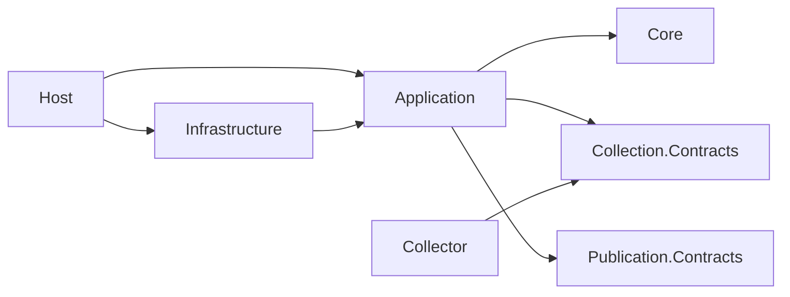

# Architecture

## Implementation status

Implemented: project boundaries, pinned SDK and package locks, CI, diagrams, the first watched-page tracer, and Core collection-import rules. Application validates people and shared watched-source membership and creates a bounded request. Infrastructure invokes the independent collector and verifies its receipt and capture bytes. Collector performs scoped HTTP collection and writes immutable content-addressed gzip artifacts. Core models immutable collection attempt results and guarded import decisions, but no application import handler, durable jobs, imports, database, feeds/discovery, AI, review, publication, or MCP are implemented yet. The remaining workflow descriptions below are target design.

The tracer crosses only the configuration, application, process adapter, and collection layers. It deliberately ends at a verified receipt, before operational evidence persistence. A capture is not a document version, approval, or publication. Configuration currently supports people and watched-source membership; dated relationships and other registry concepts remain planned.

## Product and deployment

One repository, a local C# application, a separate C# collector executable, and a static public publication. Three views share evidence: officials' statements/actions, tracked-document changes, and weekly media briefs. Registry size is not hardcoded. New officials using existing source types require configuration only; new source formats may need connectors.

## Chosen stack

| Responsibility | Choice |
|---|---|
| Application and collector | .NET 10 LTS / C#; SDK pinned in global.json |
| Local review | ASP.NET Core Razor Pages, added when implemented |
| Operational database | Local Postgres; EF Core/Npgsql; application-owned durable jobs |
| Captures | Compressed content-addressed files; immutable source and extraction versions |
| Classification | Task-specific Clef/Clef-flash adapters after evaluation |
| Extraction and drafting | Separate structured-generation adapter; model selected by evaluation |
| Public website | C# release builder with Scriban HTML templates and small JS modules |
| Local MCP | Official C# SDK; separate local development/review registration |
| Public MCP | Thin TypeScript Cloudflare Worker over published artifacts/index |
| Hosting | Cloudflare Pages and Worker; public operation independent of local machine |
| Tests/CI | xUnit, architecture/contract/integration tests, GitHub Actions |

Only the SDK and test dependencies are installed. Introduce the other packages when their phase begins and pin them. No Rust, Go, Python analysis service, or React application is planned. Python's standard library is used only for the development diagram generator.

## Dependency rules

Core contains domain invariants; Application contains use cases and interfaces; Infrastructure implements external adapters; Host wires the application. Collection.Contracts and Publication.Contracts remain dependency-free. The collector references Collection.Contracts only. Public MCP consumes the publication contract, never local application internals.

### Design and layer ownership

Build each capability from its invariants and contracts outward. Keep validation where its meaning is owned, and call the same validation at trust boundaries. Use cohesive abstractions to protect responsibilities and invariants. Use interfaces for external execution and persistence boundaries; use concrete types for internal policy and transformations unless an actual variation calls for another abstraction. Follow the existing naming and validation conventions across layers. Organize projects by architectural layer and the code within them by feature. Keep substantive public types in their own files. Add a project only when a new dependency boundary is required.

| Layer | Owns | Must not own |
|---|---|---|
| Collection.Contracts | Wire types, supported versions, request scope, receipt shape and resource accounting | Filesystem reads, scheduling, database or editorial rules |
| Core | Domain identity, evidence and review invariants as those capabilities are implemented | JSON process DTOs, HTTP, EF Core or local paths |
| Application | Use cases, configuration policy, external ports and mapping into domain evidence | Process launching, SQL or storage compression |
| Infrastructure | Process lifecycle, protocol decoding, actual capture verification, future persistence adapters | Independent definitions of contract or editorial validity |
| Collector | Bounded source interaction and complete raw capture production | Durable scheduling, imports, officials registry or publication |
| Host | Command parsing and composition | Collection algorithms or evidence invariants |

Feature folders keep related use cases, configuration and external interfaces together. Application and Infrastructure both use `Collection` for their respective parts of collection; Collector uses `Http` for its HTTP implementation. Namespaces match those folders beneath the project namespace. Contract projects remain flat while small and cohesive. Executable `Program.cs` files and genuinely project-wide types remain at project roots. There are no global `Models`, `Services`, or `Interfaces` directories that separate a feature from the types it uses.

Tests mirror the production project suffix and feature, such as `Application/Collection` and `Infrastructure/Collection`; collection protocol tests live in `Collection/Contracts`. Cross-project dependency checks live in `Architecture`. Shared sample factories live in `Fixtures` when multiple test groups need the same contract examples, so one test class does not depend on another for its setup. The root README remains the navigation map and the solution remains the project inventory.

MVC and Razor Pages are presentation choices within Host. The planned review UI will use Razor Pages and call the same application handlers as CLI and local MCP. Business rules, collection, jobs and persistence retain their own layer and feature ownership. New feature folders are added with implemented code; publication, persistence and UI areas are not scaffolded in anticipation of later phases.

The implemented `ICollectorProcess` is an external boundary used by `CollectWatchedPage`. `CollectionResult.ValidateAgainst` owns receipt validity; collector, application and process adapter reuse it. Infrastructure additionally verifies the file bytes. Structural validity does not prove that an artifact exists or matches its hash. Wire DTOs remain separate from future domain evidence and database entities, so changing transport layout does not require changing persistence semantics.

A collection attempt result records what happened during one completed source check, including failures and HTTP 304 responses. This historical evidence record is also called an observation in the collection protocol. A capture identifies exact response body bytes by SHA-256, after removing the storage gzip envelope but before decoding HTTP content encodings. HTTP response metadata belongs to the observation. The same capture can occur with different content types, encodings or validators, and must not erase those observations. A document version is a later domain concept; a raw hash alone does not establish a semantic edit or parser version.

Core's `Collection` feature implements these rules as immutable domain values and a pure `CollectionImportPolicy`. Attempt identity is independent of job identity. A new attempt with identical bytes remains a separate result; capture identity is the hash and byte length, without a storage path. Response metadata belongs to the attempt result, including a defensive snapshot of ordered content encodings. Domain construction guards evidence invariants; wire parsing, HTTP header syntax, scope, budgets, and file verification remain at their existing boundaries.

Collection attempt results have separate sealed `CapturedAttemptResult`, `NotModifiedAttemptResult`, `FailedAttemptResult`, and `DeferredAttemptResult` types sharing an abstract `CollectionAttemptResult` base. Each outcome exposes only the data it can carry: a capture belongs to the captured type, failure information to failed/deferred types, and a retry delay to the deferred type. This makes contradictory combinations unavailable through the public API rather than relying on an outcome enum and nullable fields. Constructors still validate required values. Duplicate comparison includes the concrete outcome type and its data.

`CollectionResponse` constructs an `ImmutableArray<string>` for ordered content encodings. Mutable inputs are copied, empty collections are valid, and uninitialized immutable arrays are rejected. Equality compares encoding values in order, not array identity. Wire records retain their existing JSON-friendly arrays and validation; domain constructors own immutable evidence. This difference reflects the transport and evidence responsibilities, without changing the collector protocol or adding package dependencies.

`CollectionImportPolicy.Decide` returns an immutable `CollectionImportDecision` with an `ImportDisposition` of `NewAttempt` or `DuplicateAttempt`. These classify the import, not lifecycle transitions. Reimporting identical attempt data and sent validators preserves the original result and capture link; conflicting reuse of an attempt ID is rejected. `PriorCaptureLinkStatus` is `NotApplicable` for other outcomes, or `Unresolved` or `Linked` for a 304. `PriorCapturedAttempt` identifies the linked evidence separately from the current `AttemptResult` and its response metadata. Linking requires a distinct, earlier or simultaneous captured observation for the same source and exact URLs, with no redirect on the conditional attempt. The sent ETag takes precedence over Last-Modified and must match exactly; a conflicting returned ETag leaves the prior capture link unresolved. Without an ETag, a matching sent Last-Modified can establish the binding. Missing proof retains the 304 without a capture link. Failed and deferred attempts carry no capture and cannot replace prior evidence.

Attempt results are immutable outcomes: captured, not modified, failed, or deferred. A retry produces a new attempt; it does not change a failed result into a captured result. The import policy is a pure decision function, not a durable lifecycle state machine. It performs no I/O and does not prove that supplied captures were verified or persisted. The next application handler will map verified receipts under an application-owned attempt identity; the persistence adapter must atomically enforce unique attempts and capture identity. The database adapter and durable job state machine remain separate subsequent checkpoints. Job transitions will govern claiming, retry, cancellation, and recovery; project dependency tests continue to enforce layer boundaries.

<!-- diagrams:start -->
### Collection to publication (target)

Target workflow. Configuration, bounded watched-page collection, and verified file captures are implemented; durable evidence storage and downstream stages remain planned.

```mermaid
flowchart LR
    config["Coverage configuration"]
    app["C# application"]
    collector["C# collector"]
    evidence["Evidence store"]
    analysis["Selective analysis"]
    review["Local review and MCP"]
    release["Versioned release"]
    public["Website and public MCP"]
    config --> app
    app --> collector
    collector --> evidence
    evidence --> analysis
    analysis --> review
    review --> release
    release --> public
```

### Project dependencies (implemented)

Arrows mean references. These project boundaries are checked by xUnit tests.

<!-- diagrams:end -->

The HTML explorer is generated from the same diagram definitions: `python3 tools/render-architecture.py`, then open `artifacts/architecture.html`. Planned components are explicitly labeled there; it is not a claim that the pipeline exists.

## Configuration and identity

Version-controlled configuration is authoritative for people, organizations/offices, dated terms/affiliations, dated source relationships, issues, coverage membership, and collection/analysis policies. The database imports validated configuration revisions; it is not a second editable registry. Runtime cursors and job state live in the database.

Stable person IDs outlive office/account changes. An institutional account is not a person's alias. Removing coverage stops future dedicated collection but preserves history and identity resolution; public visibility is a separate control. Shared sources are collected once, regardless of how many officials reference them. Configuration changes must show estimated work and bounded backfill before execution.

## Collection boundary

C# schedules bounded discovery, fetch, and watch jobs. The collector receives versioned JSON manifests, emits JSONL result records on stdout and diagnostics on stderr, and writes capture artifacts under an assigned directory. C# validates and imports results idempotently. There is one durable scheduler. Newly discovered URLs return as candidates for that scheduler.

Requests carry source identity, allowed hosts/paths, cursors/validators, request/byte/time budgets, and job identity. Results carry requested/final URLs, status, timestamps, validators, content hashes, artifact references, discovered links, resource usage, and structured failures. Credentials are resolved separately and never logged in manifests.

Initial connectors: HTTP, feeds, and bounded HTML discovery. Required behavior includes robots checks, redirect/destination validation, per-host pacing, conditional requests, correct 304 and 429 handling, cancellation, and explicit oversized/incomplete response failures. Coordinate host pacing across collectors; initially avoid concurrent collector processes for the same host. Browser rendering/OCR are deferred until a selected source needs them.

Every fetch attempt is an observation. Only changed content creates new versions. Raw and normalized hashes are separate. Failed fetches do not mean deletion; parser changes do not mean source edits. Source-configured limits and deduplication run before AI.

### Implemented watched-page protocol

`Collection.Contracts` owns JSON protocol version 2. Configuration remains independently versioned at 1. The collector accepts `collect <manifest.json>` and emits exactly one JSONL receipt for a valid request. Both sides reject unsupported/missing versions, unknown fields, duplicate fields, and null required fields. Wire names are case-sensitive camelCase. Exit codes are 0 for captured/notModified, 1 for failed/deferred, and 2 for invalid input. Diagnostics go to stderr. Shared contract validation checks result identity, outcome, destination, and budgets; Infrastructure verifies the exact decompressed artifact length and SHA-256 before returning the receipt.

A request identifies one job and source, one URL, one exact allowed origin (scheme, host, port), a path or descendant prefix, an absolute artifact directory, and request/aggregate-byte/time/pacing limits. Optional ETag and Last-Modified validators support explicit conditional requests. There is no credential field. Defaults are 5 requests, 2 MB, 30 seconds, and 1 second between requests. The collector always requests `/robots.txt` first on the same origin, outside the content path restriction. Redirects must remain within the declared content scope.

Receipts distinguish `captured`, `notModified`, `deferred`, and `failed`. They carry requested/final URLs, observation time, request count, aggregate received body bytes, a closed failure code, and optional Retry-After seconds. `finalUrl` identifies the last attempted in-scope content URL, or the requested URL if no content request was made. `observedAt` is the completion time of this attempt, not publisher or event time.

`response` contains the content response status, ETag, Last-Modified, full Content-Type including charset parameters, and ordered Content-Encoding tokens. It is null when no valid content response metadata was received, including failures while checking robots. Headers from an earlier redirect are not attached to a later failed request. An absent Content-Type stays null; an absent Content-Encoding becomes an empty array. Codings remain in application order, including unknown tokens. This layer preserves encoded bytes and does not claim they can already be decoded. Malformed or oversized representation metadata produces `failed` with `invalidResponse` before a capture is written. Header values are bounded to 4,096 characters for Content-Type and ETag and 16 coding tokens of at most 64 characters each.

Only `captured` receipts contain `capture`: a lowercase `sha256`, relative `<sha256>.gz` `relativePath`, and exact `byteLength`. The length and hash describe HTTP response body bytes with content encodings still applied, not the gzip storage envelope. Aggregate `bytesReceived` includes robots; `capture.byteLength` describes only the content body. Headers and transport framing are not counted. An overflow probe may read one extra byte to detect an oversized unknown-length body; that byte is discarded. No normalized text is produced yet.

Version 2 deliberately rejects version 1 manifests and receipts. There is no automatic receipt migration or metadata inference: earlier receipts do not contain enough information to reconstruct all representation headers. Rebuild host and collector together and change standalone manifests to version 2; configuration stays at version 1. Stored hash-named gzip files keep their byte format and remain reusable after verification. Future wire changes require an explicit compatibility decision, with tests for unsupported versions and invalid outcome combinations.

Captures are atomically promoted after a complete download, with existing content checked before reuse. Unchanged bodies share an artifact; this is file deduplication, not a durable idempotent import. Failures and 304/429 responses have no artifact. A 429 is returned as deferred with Retry-After when supplied; no retry is scheduled in this tracer. Host cancellation kills the child and accepts no receipt, so a killed process can leave an unreferenced temporary file. Durable recovery and orphan cleanup remain scheduler work.

Robots support is conservative: matching wildcard and CivicLens groups contribute Disallow rules, including `*` and terminal `$`; Allow exceptions and crawl-delay are not implemented. A 404 permits fetching. Other unavailable responses, nonidentity content encodings, malformed UTF-8, and rules beyond supported limits fail closed; robots redirects are not followed. Request budgets include robots and content redirects. Pacing applies within a run. The host serializes processes sharing an artifact directory; operators must avoid concurrent runs for the same origin across different directories or standalone collectors. Cross-run pacing and durable host backoff remain scheduler work.

## Evidence and AI

The data model will distinguish capture observations, immutable document versions, changes, statements, authoritative actions, proposed relationships, analysis runs, reviews, briefs, and publication releases. Evidence points to exact versioned text spans/page locations. Event time, publisher time, observed time, and last-checked time remain distinct.

Structured actions bypass relevance models. Explicitly watched documents retain versions regardless of relevance decisions. Classification of unstructured material begins in observation mode. Later routing supports process, defer, and skip-expensive-analysis, with reasons and retained input references. Audit a sample of skipped records. Do not silently truncate long documents; record chunk coverage and extraction failures.

Clef is a decision classifier, not the quotation extractor or brief writer. Extraction returns validated source evidence. Match statements/actions using identifiers, people, dates, jurisdiction, and issue candidates before any model comparison. Relationship assessments require editorial context. Briefs use bounded evidence selections and citation IDs.

Cache keys include input hashes, task/model/schema versions, and relevant configuration/context. Store model responses and provider metadata; hosted aliases may change. Enforce per-task and per-run limits. Budget exhaustion leaves visible pending work. Measure false negatives, precision, calibration, latency, downstream savings, and review workload on held-out examples, grouped to prevent document-version leakage.

## Review and MCP

Local development MCP will inspect jobs, explain processing, inspect source health, compare analysis runs, and run explicitly budgeted evaluations. Review tools will list/read cases, propose corrections, and record explicit decisions. Mutations use expected versions and idempotency keys. AI suggestions, model predictions, and human decisions are distinct records. Initial local tooling is read-only; mutations arrive with the review workflow.

Public MCP will expose search_records, get_record, get_official_timeline, and compare_document_versions. It retrieves published data with IDs, citations, dates, review status, coverage caveats, and release ID. It cannot initiate collection, inference, or edits. Bound and paginate responses, limit requests, accept record IDs rather than arbitrary fetch URLs, and treat source passages as untrusted attributed content.

## Publication and operations

Build HTML, records, and a bounded search index from an explicit approved selection. Validate citations and approval versions before publishing. Upload a complete versioned release, then change the active release pointer. Website and MCP share that release; clients can pin it across calls. Previous releases support rollback. Keep operational storage and unpublished material private.

Local Postgres and capture files need coordinated backups and a tested restore. Retention must preserve evidence referenced by published releases; disposable captures follow explicit policy. Monitor freshness, skipped/deferred work, source failures, storage, and spend. Public MCP requires request compute, but never the local database or AI inference.

## Legacy reuse

Use the legacy crawler's fixtures and lessons about normalization, robots, pacing, redirects, retries, atomic capture, and recovery. Reimplement in C# against the new contract. Verify registries before selective import. Preserve provenance for any migrated records. Do not port bot/propaganda/sentiment pipelines, live dashboard aggregation, old storage schemas, duplicate registries, deployment secrets, or historical documentation.
