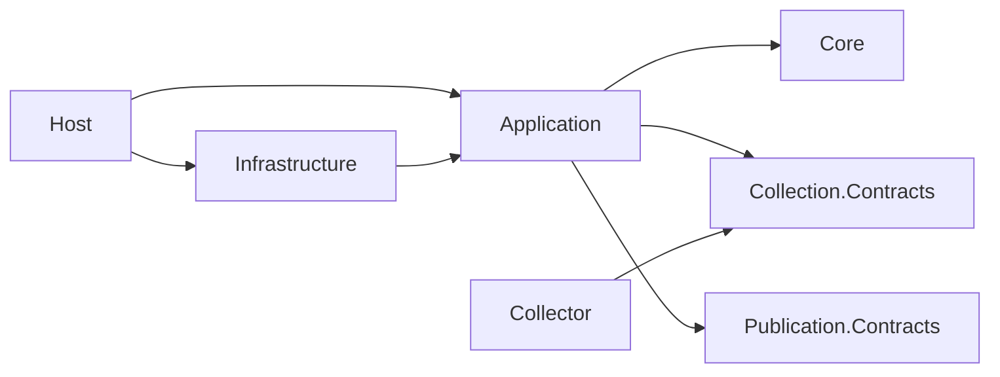

# Architecture

## Implementation status

Implemented: project boundaries, pinned SDK and package locks, CI, diagrams, the first watched-page tracer, Core collection-import rules, an Application collection/import handler, a Postgres persistence adapter with an initial EF migration, explicit CLI database setup and collection/import, and filesystem receipt handoff/replay. Application validates people and shared watched-source membership and creates a bounded request. Infrastructure invokes the independent collector and verifies its receipt and capture bytes. Collector performs scoped HTTP collection and writes immutable content-addressed gzip artifacts. Core models immutable collection attempt results and guarded import decisions, and Application maps verified receipts into those rules. The persistence adapter is exercised against disposable Postgres containers. Managed durable job execution and recovery are implemented, including persisted robots crawl-delay pacing. RSS/Atom and scoped HTML discovery and explicit bounded article admission are implemented. Configuration v2 adds dated coverage and names; configuration-based managed jobs retain immutable configuration revisions and coverage dates. Immutable HTML/plain-text extractions, reusable versioned content profiles, and exact local citation spans are implemented. Derived document histories, immutable contextual comparisons, and a local read-only Razor Pages evidence viewer are implemented. Document-change drafts, immutable revision/decision persistence, and an Auth0-protected Razor Pages review workspace are implemented. Live Auth0 tenant verification, production deployment, AI, publication, and MCP remain pending. The remaining workflow descriptions below are target design.

The tracer crosses only the configuration, application, process adapter, and collection layers. It deliberately ends at a verified receipt, before operational evidence persistence. A capture is not a document version, approval, or publication. Configuration supports stable people, optional dated names, and dated coverage memberships. Offices, terms, institutional ownership, and historical attribution remain planned.

## Product and deployment

One repository, a C# application with a shared hosted production workspace, a separate C# collector executable, and a static public publication. Three views share evidence: officials' statements/actions, tracked-document changes, and weekly media briefs. Registry size is not hardcoded. New officials using existing source types require configuration only; new source formats may need connectors.

### Approved editorial experience (target)

The primary audience is regular citizens seeking political transparency in the United States, initially at the national level. State and local coverage are possible future extensions, not initial scope. The approved direction is an editorial publication of selected, reviewed accounts with inspectable evidence. The flow is agreed. The first static release of document-change accounts is implemented; issue, official, and briefing pages remain planned. The first private document-change drafting and review workflow is implemented. The local read-only evidence viewer is implemented. The temporary HTML prototype demonstrates the direction with fictional content and simulated decisions, not production behavior. The chosen identity is restrained monochrome with charcoal, white, and gray for structure; semantic color remains for evidence changes, status, and keyboard focus. Precise public layouts remain to be implemented.

Public readers start with a weekly briefing and recent reviewed developments. Issue pages connect related records across officials and institutions; official pages show dated statements, actions, and reviewed relationships. A record explains what happened, who was involved, when, why it matters where supported, and what the evidence can and cannot establish. Readers can move from the account into retained passages and exact citations without having to interpret collection jobs or extraction metadata first. Document-change records expose both versions and observation history where needed to explain gaps. A current source link supplements, rather than replaces, the retained evidence used for review.

Use plain language and distinguish statements, proposals, and completed actions. An introduced bill is not an enacted law; chronology alone does not establish causation or a relationship between a statement and an action. Distinguish event and publication dates from observation dates, and preserve uncertainty about exact edit times. Briefs identify their selection period and cutoff. Coverage is explicitly selective: missing records do not establish inactivity, and relevant source failures remain visible as coverage limitations.

The private editorial workspace centers the proposed public record beside its supporting evidence. Document history and comparisons support investigation within that flow. Reviewers assess wording, quotation fidelity, attribution, dates, context, citations, and interpretation. For document changes they distinguish substantive source edits from navigation churn or processing changes; for relationships they verify the claimed connection; for briefs they verify each assertion and the coverage description. Supported explanations of significance are editorial judgments requiring review, not automatic consequences of text differences.

Human approval binds to the exact public content and evidence versions reviewed. Editing either requires review of the changed version; earlier approvals remain historical and do not authorize the revision. Approval and publication are separate actions: publication selects approved records into a release. Unreviewed proposals, internal reviewer notes, operational job details, and mutation controls remain private. Public records expose their review/version context and published corrections, while public serving continues to consume published releases only. The prototype's switch between public and private views is a demonstration aid, not a public deployment feature.

This direction guides the first evidence viewer and subsequent review/publication work. The drafting, permissions, review decisions, correction behavior, and concurrency rules below are agreed. Their database schema, shared handlers, and private review pages are implemented; public release assembly and correction/withdrawal releases remain planned. The existing Razor Pages, shared Application handlers, and static release boundaries remain unchanged.

### Initial drafting and review workflow

An operator chooses a document change and explicitly creates a public-record draft from its saved comparison. Automatic preparation queues complete text changes for consideration; reviewers explicitly start and write an account. AI drafting is not implemented. Each explicit save retains an immutable revision of the public wording and its evidence bindings. Review presents that revision beside the supporting before/after passages, with technical identifiers kept in evidence details. The approved HTML mockup remains the interaction and layout reference; the current ID-based evidence lookup is supporting functionality, not the intended editorial entry point.

One authorized operator may both draft and approve a record; a separate approver is not required. The workspace must also support the owner's friend as an additional authorized drafter/reviewer, with separate sign-ins through Auth0 and individual attribution of decisions. Successful sign-in alone must not grant editorial access. Approval remains bound to an exact revision and distinct from publication. Auth0 OIDC authentication and review mutations are implemented, with live tenant verification still pending. Both reviewers will reach the shared production workspace on Hetzner through their browsers. The existing read-only viewer remains loopback-only and excludes review routes. The separate authenticated review command also binds loopback and expects an HTTPS reverse proxy; it is not deployed yet.

### Approved document-change review rules

The first editorial record starts from an explicitly selected, complete saved comparison containing an actual text change. A comparison does not establish substantive significance. The public record contains a headline, plain-language summary, optional evidence-supported significance, limits and uncertainty, source institution attribution, supported official links, configured issue categories, and bindings to the exact comparison, before/after versions, and cited passages. Earlier/later observation dates remain distinct from an actual change date, which is included only when supported. Public output includes review/publication dates and correction context; author identity, reviewer email, Auth0 identifiers, and private notes are excluded from the release contract.

Every explicit draft save retains an immutable revision of wording, attribution, issue selection, and evidence bindings. Incomplete drafts can be saved; approval requires mandatory fields and valid citations. Each record has one current revision. Editing an approved revision creates a new unapproved revision without changing historical approval or an already published record. The UI warns before leaving unsaved edits; autosave is not part of the first workflow.

A saved revision starts awaiting review. Decisions target an exact revision, retain the authenticated actor, and are immutable:

| Decision | Effect and requirements |
|---|---|
| Approve | Marks the revision suitable for publication after checking wording, attribution, dates, context, citation fidelity, and substantive significance. One authorized approval suffices; self-approval is allowed. |
| Request changes | Blocks publication until explicitly resolved; requires a note describing needed corrections. |
| Withdraw approval | Invalidates the effective approval and blocks future publication; requires a reason. |

Either reviewer can raise a blocking concern. A subsequent approval must explicitly acknowledge outstanding concerns and include a resolution note. Unresolved concerns carry forward as publication blockers when a new revision is saved. An approval on the current revision records the exact outstanding decision IDs it resolves and a resolution note; the original decisions retain their original revision bindings. Merely saving a revision never resolves a concern. These decisions are distinct from publication and cannot be edited or deleted.

Writes use expected versions rather than editing locks or last-write-wins. Draft saves check the expected current revision atomically. A stale save returns a conflict while preserving the operator's unsaved text for comparison with the latest revision; the UI does not silently merge editorial wording. Review decisions check both the expected current revision and review-state version atomically. A changed revision or intervening review decision requires refreshing before deciding. Idempotent retries of the same successful request return the original outcome, without duplicate revisions or decisions; keys are scoped to the authenticated actor and operation, bound to the request payload, and conflicting payload reuse is rejected. Authorization is checked before returning either a replayed or new outcome. Shared Application handlers own these rules for UI, CLI, and future MCP callers.

The owner can draft, review, publish, and manage editorial access. The additional reviewer can draft and review, but cannot publish or manage access. Both use separate Auth0 identities. Authentication alone confers no editorial permissions; authorization is enforced at mutation boundaries, not just by hiding UI controls.

Publication explicitly selects currently approved revisions and retains the exact approved content and required evidence in immutable release artifacts. Review state must be checked when committing publication so a concurrent blocking decision cannot be ignored. A newer draft does not replace published content automatically. Corrections require a new revision, approval, a public correction note, and a new release. Withdrawing approval does not mutate previously published artifacts; the UI flags published affected records for an explicit correction or withdrawal release. Public serving reads release contracts only and cannot inspect operational storage or private notes.

The first publication design is agreed. Only the owner publishes. A record is published at its current revision, and only when that revision is approved and has no unresolved concerns. A release is cumulative. It holds the base release's records plus explicit additions or replacements. Carried records are hard links to the base release's immutable files. Disk therefore grows with published records, not with the number of releases. The public record ID is the draft ID.

Each record carries the full extracted text of both versions. It also carries their source URLs and observation times. Changed regions are offsets into those texts. A citation holds an extraction ID, UTF-16 offsets, and the quoted text. The contract rejects a quote that does not match its offsets. Records show the approval date and the first-publication date. The release index shows the release date. A release holds at most 2,000 records. The index lists 50 records per page, newest first. The pages are `index.html`, then `page-2.html` and so on, with relative previous and next links. Officials appear by their configured name. Issues appear by their configured identifier. Only the release manifest shows the schema version.

Application builds the release contract. Host renders the shared Razor components to static HTML, so no new project is needed. One owner action builds the release into a staging directory, verifies it, and moves it to a uniquely named directory under `releases/`. Under the review lock, it then rechecks each added record's revision and review-state version. In the same transaction, it records a sequentially numbered release and marks it as the active release. After the commit, it atomically replaces a relative `current` symbolic link. A commit that fails on a conflict or invalid input deletes its directory. If that cleanup fails, or an unknown failure occurs, the directory stays. Only committed releases can be activated.

Postgres records which release is active. The `current` link is a copy of that record for the static server. Each publication builds on the recorded active release, not on the link. A failed link swap therefore never drops committed records. A replayed publish request and the activate command both point the link at the recorded active release, and this repairs a link that is out of date. Rollback is a CLI command. It records an earlier release as active and then points the link at it. The next publication builds on the rolled-back release, so it does not restore the records that were rolled back. All releases are kept until a retention policy is agreed. Publish requests reuse the review replay receipts. Correction and withdrawal releases come later. A separate static file server serves the release root read-only, with no access to operational storage. How it runs locally is not yet decided.

Drafting, review, and first publication rules above are implemented; public correction and withdrawal releases remain target rules. The Host pins `Microsoft.AspNetCore.Authentication.OpenIdConnect` 10.0.12 for Auth0 authorization-code flow with PKCE. Server configuration maps exact subject IDs to owner/reviewer roles; client role claims confer no permissions. Access changes currently require updating server configuration and restarting, not a management UI. Only the owner can publish or activate a release. The CLI acts as the configured owner subject.

Core/Review owns decision semantics; Application/Review owns authenticated commands and configured selection validation; Infrastructure/Review implements the existing store boundary using PostgreSQL. Four additive tables retain record pointers, immutable revision JSON, immutable decision JSON, and actor/operation/request-key replay receipts. A transaction-scoped advisory lock serializes review mutations. Draft and decision expected versions are checked in that transaction. Revisions retain author and UTC save time. Decisions reference the exact revision with a composite foreign key. Reads validate stored identities, historical transitions, and exact retained evidence. A read verifies each comparison and its two extractions once and reuses them for every revision. Publication loads all selected drafts and their verified evidence in one repeatable-read transaction. That read uses seven queries for any selection of 1 to 64 drafts. The publisher builds records from this evidence and does not read it again.

Bounds are explicit: 64 revisions and 128 decisions per record, 64 outstanding concerns, 64 citations per revision, and bounded field sizes. Writes fail before exceeding history bounds; paged history beyond these bounds remains future work. Initial citations select positive ranges from the first 32 comparison hunks; the editor offers all comparison hunks for explicit selection within the citation count limit. Comparison browsing scans a bounded batch and supplies a continuation even when no eligible change is found in that batch. The workspace preserves conflicting edits, disables decisions for unsaved or failed/conflicting forms, and uses antiforgery tokens on mutations. The reader preview updates on server render after explicit saves; live preview/autosave are not implemented.

Razor components are the chosen reusable presentation unit. The implemented local viewer and private review workspace remain Razor Pages while shared display patterns move into components incrementally. Shared components receive explicit display data and styling; they do not read operational storage or decide editorial state. The C# release builder renders public components to immutable static HTML from published release data, with the release's own CSS and a small JavaScript module for the comparison toggle; pages also work without JavaScript. `RecordPreview` and `DocumentComparisonView` take explicit display data, so private pages and public release pages render the same components. Interactive Blazor may be added to private workflows when warranted; a future live public Blazor deployment must read published releases only and stay separate from the operational application. One restrained monochrome identity serves public and private surfaces through shared design tokens. The review workspace uses denser layout where the task requires it. Public reader search/filtering, timelines, expandable evidence, and shareable records remain planned against published releases. A future mobile client would consume public release contracts through an API rather than operational storage. Presentation choices must not move editorial rules into UI code.

Presentation ownership is enforced by architecture tests: theme colors belong to `wwwroot/css/theme.css`, page markup cannot introduce inline styles, and the shared workspace layout owns the shell and stylesheet loading. The authenticated review and evidence routes and the local read-only viewer use that shell with permission-appropriate navigation. Document comparison and editorial review render the same `DocumentComparisonView` component, with exact cited passages, contextual text, and an accessible reading-order/side-by-side control. The comparison page can create an eligible private review draft through the existing shared Application handler; the standalone viewer remains read-only.

### Approved production hosting (planned)

Initial production runs on the existing Hetzner CPX21. Containers host the application, collection/background jobs, and PostgreSQL with persistent storage. Terraform manages infrastructure and CI automates deployment. Production collection, review, publication, and recovery must operate without the developer workstation; local development remains supported. Hosting is agreed, but provisioning and deployment automation are not implemented. Build and validate MVP functionality and sufficient citizen/reviewer UI locally first; live Auth0 tenant login and proxy verification, Terraform, and Hetzner deployment remain for the infrastructure stage. Retain the application boundaries now without making live infrastructure a prerequisite for feature development.

Retained evidence and database backups require off-server storage and tested restoration. Approved static releases will be served from the same Hetzner CPX21 by a static file server separate from the operational application and storage. A release is a self-contained, immutable directory; switching the active release must be atomic and preserve earlier releases for rollback. The public server reads only published files, not the operational database or capture store. The off-server backup destination remains to be selected within Hetzner's services; S3 is not planned. Auth0 remains the selected identity provider. AI uses hosted inference initially, with the provider and models selected through evaluation. Existing application boundaries isolate storage, execution, and model adapters from domain rules.

The initial deployment accepts single-host downtime during maintenance or failure. Durable recovery, backup monitoring, bounded worker concurrency, capacity checks, and a restoration exercise are production requirements. The separately served public release must remain usable when the operational application, worker, or database is unavailable while the host itself remains up. Terraform rebuilds infrastructure; restoring persisted data requires backups. No production availability or recovery guarantee has been demonstrated yet.

## Chosen stack

| Responsibility | Choice |
|---|---|
| Application and collector | .NET 10 LTS / C#; SDK pinned in global.json |
| Presentation | ASP.NET Core Razor Pages viewer and private review workspace implemented; shared monochrome tokens and first Razor record component implemented |
| Operational database | Postgres; EF Core/Npgsql; application-owned durable jobs; persistent Hetzner deployment planned |
| Captures | Compressed content-addressed files; immutable source and extraction versions |
| Classification | Task-specific Clef/Clef-flash adapters after evaluation |
| Extraction and drafting | Separate structured-generation adapter; model selected by evaluation |
| Public website | C# release builder renders shared Razor components to static HTML from published contracts; a small JS module adds the comparison toggle |
| Local MCP | Official C# SDK; separate local development/review registration |
| Public MCP | Separate deployment over published artifacts/index; Cloudflare Worker remains a candidate |
| Production hosting | Hetzner CPX21 containers and separately served local static releases; Terraform and CI deployment planned |
| Tests/CI | xUnit, architecture/contract/integration tests, GitHub Actions |

The SDK, EF Core/Npgsql persistence packages, AngleSharp 1.8.3 in Collector and Infrastructure, and test dependencies including Testcontainers are installed and pinned. Collector uses AngleSharp for discovery; Infrastructure uses it for document text extraction. Neither parser executes scripts or requests linked resources. The executables keep independent parser adapters at their existing boundaries; document extraction does not add a Collector project reference or put parsing dependencies in Core or contracts. EF Core Design is private tooling in Infrastructure; database dependencies are forbidden in the other production projects. Introduce remaining packages when their phase begins and pin them. No Rust, Go, Python analysis service, or React application is planned. Python's standard library is used only for the development diagram generator.

## Dependency rules

Core contains domain invariants; Application contains use cases and interfaces; Infrastructure implements external adapters; Host wires the application. Collection.Contracts and Publication.Contracts remain dependency-free. The collector references Collection.Contracts only. Public MCP consumes the publication contract, never local application internals.

### Design and layer ownership

Build each capability from its invariants and contracts outward. Keep validation where its meaning is owned, and call the same validation at trust boundaries. Use cohesive abstractions to protect responsibilities and invariants. Use interfaces for external execution and persistence boundaries; use concrete types for internal policy and transformations unless an actual variation calls for another abstraction. Follow the existing naming and validation conventions across layers. Organize projects by architectural layer and the code within them by feature. Keep substantive public types in their own files. Add a project only when a new dependency boundary is required.

| Layer | Owns | Must not own |
|---|---|---|
| Collection.Contracts | Wire types, supported versions, request scope, receipt shape and resource accounting | Filesystem reads, scheduling, database or editorial rules |
| Core | Domain identity, evidence and review invariants as those capabilities are implemented | JSON process DTOs, HTTP, EF Core or local paths |
| Application | Use cases, configuration policy, external ports and mapping into domain evidence | Process launching, SQL or storage compression |
| Infrastructure | Process lifecycle, protocol decoding, actual capture verification, Postgres persistence | Independent definitions of contract or editorial validity |
| Collector | Bounded source interaction and complete raw capture production | Durable scheduling, imports, officials registry or publication |
| Host | Command parsing and composition | Collection algorithms or evidence invariants |

Feature folders keep related use cases, configuration and external interfaces together. Application and Infrastructure both use `Collection` for their respective parts of collection; Collector uses `Http` for its HTTP implementation. Namespaces match those folders beneath the project namespace. Contract projects remain flat while small and cohesive. Executable `Program.cs` files and genuinely project-wide types remain at project roots. There are no global `Models`, `Services`, or `Interfaces` directories that separate a feature from the types it uses.

Tests mirror the production project suffix and feature, such as `Application/Collection` and `Infrastructure/Collection`; collection protocol tests live in `Collection/Contracts`. Cross-project dependency checks live in `Architecture`. Shared sample factories live in `Fixtures` when multiple test groups need the same contract examples, so one test class does not depend on another for its setup. The root README remains the navigation map and the solution remains the project inventory.

Razor Pages implements the local read-only evidence viewer and private review workspace within Host. The review workspace calls application handlers for editorial actions, while the viewer remains read-only. Both surfaces load the same versioned monochrome theme stylesheet, and the review editor uses a display-only Razor component for its reader preview. Shared Razor components will continue to be introduced where actual presentation repeats; business rules, collection, jobs, and persistence retain their own layer and feature ownership. New feature folders are added with implemented code; publication, persistence, and UI areas are not scaffolded in anticipation of later phases.

The implemented `ICollectorProcess` is an external boundary used by `CollectWatchedPage`. `CollectionResult.ValidateAgainst` owns receipt validity; collector, application and process adapter reuse it. Infrastructure additionally verifies the file bytes. Structural validity does not prove that an artifact exists or matches its hash. Wire DTOs remain separate from future domain evidence and database entities, so changing transport layout does not require changing persistence semantics.

A collection attempt result records what happened during one completed source check, including failures and HTTP 304 responses. This historical evidence record is also called an observation in the collection protocol. A capture identifies exact response body bytes by SHA-256, after removing the storage gzip envelope but before decoding HTTP content encodings. HTTP response metadata belongs to the observation. The same capture can occur with different content types, encodings or validators, and must not erase those observations. A document version is a later domain concept; a raw hash alone does not establish a semantic edit or parser version.

Core's `Collection` feature implements these rules as immutable domain values and a pure `CollectionImportPolicy`. Attempt identity is independent of job identity. A new attempt with identical bytes remains a separate result; capture identity is the hash and byte length, without a storage path. Response metadata belongs to the attempt result, including a defensive snapshot of ordered content encodings. Domain construction guards evidence invariants; wire parsing, HTTP header syntax, scope, budgets, and file verification remain at their existing boundaries.

Collection attempt results have separate sealed `CapturedAttemptResult`, `NotModifiedAttemptResult`, `FailedAttemptResult`, and `DeferredAttemptResult` types sharing an abstract `CollectionAttemptResult` base. Each outcome exposes only the data it can carry: a capture belongs to the captured type, failure information to failed/deferred types, and a retry delay to the deferred type. This makes contradictory combinations unavailable through the public API rather than relying on an outcome enum and nullable fields. Constructors still validate required values. Duplicate comparison includes the concrete outcome type and its data.

`CollectionResponse` constructs an `ImmutableArray<string>` for ordered content encodings. Mutable inputs are copied, empty collections are valid, and uninitialized immutable arrays are rejected. Equality compares encoding values in order, not array identity. Wire records retain their existing JSON-friendly arrays and validation; domain constructors own immutable evidence. This difference reflects the transport and evidence responsibilities, without changing the collector protocol or adding package dependencies.

`CollectionImportPolicy.Decide` returns an immutable `CollectionImportDecision` with an `ImportDisposition` of `NewAttempt` or `DuplicateAttempt`. These classify the import, not lifecycle transitions. Reimporting identical attempt data and sent validators preserves the original result and capture link; conflicting reuse of an attempt ID is rejected. `PriorCaptureLinkStatus` is `NotApplicable` for other outcomes, or `Unresolved` or `Linked` for a 304. `PriorCapturedAttempt` identifies the linked evidence separately from the current `AttemptResult` and its response metadata. Linking requires a distinct, earlier or simultaneous captured observation for the same source and exact URLs, with no redirect on the conditional attempt. The sent ETag takes precedence over Last-Modified and must match exactly; a conflicting returned ETag leaves the prior capture link unresolved. Without an ETag, a matching sent Last-Modified can establish the binding. Missing proof retains the 304 without a capture link. Failed and deferred attempts carry no capture and cannot replace prior evidence.

Attempt results are immutable outcomes: captured, not modified, failed, or deferred. A retry produces a new attempt; it does not change a failed result into a captured result. The import policy is a pure decision function, not a durable lifecycle state machine. It performs no I/O and does not prove that supplied captures were verified or persisted.

`CollectAndImportCollectionAttempt` maps verified receipts under an explicit application-owned attempt identity independent of the wire job ID. `ICollectionAttemptStore.ImportAtomicallyAsync` requires the adapter to load existing and prior evidence, apply the Core policy, and commit within one atomic operation. `StoredCollectionAttempt` contains the attempt result, sent validators, and prior capture link; new-or-replay disposition belongs only to the current call. The Postgres adapter atomically enforces unique attempts and capture identity.

Collection runs through `ICollectorProcess`, which verifies capture bytes before returning; receipt validation runs again before mapping. Collector execution or verification errors, invalid receipts, and cancellation prevent import. Failed and deferred collection outcomes remain valid evidence to import. Retry-After values beyond the domain `TimeSpan` range are rejected before persistence rather than truncated. Each fresh handler invocation performs collection and saves a handoff before importing. The separate recovery handler replays saved receipts without invoking the collector. Managed jobs compose the same evidence import and receipt handoff boundaries. The CLI retains the receipt-only tracer as `collect` and invokes the import handler through `collect-import`. Job transitions govern claiming, retry, cancellation, and recovery; project dependency tests continue to enforce layer boundaries.

### Managed collection jobs

Application's `Collection/Jobs` owns the job lifecycle and runner. `ICollectionJobStore` is the external atomic persistence boundary, implemented by Postgres in Infrastructure. Jobs move through Pending, Running, WaitingToRetry, Succeeded, Failed, and Cancelled. A completed HTTP observation remains immutable; retry creates a distinct attempt ID and a distinct collector wire request ID. Interrupted execution without a complete receipt is job history, not invented HTTP evidence.

Enqueue snapshots one selected source's settings, explicit validators, and retry/budget policy. An explicit idempotency key returns the same job for an equal definition and rejects conflicting reuse. Runtime artifact roots are supplied at run time. One manual run reconciles an unresolved attempt first and performs at most one new collection. `CollectionJobWorker` runs the durable pipeline in a separately launched process. It interleaves bounded collection pages with evidence processing through the same fenced handlers. The default page size is 20 (maximum 100). It drains runnable work before waiting for PostgreSQL notifications or persisted retry, pacing, and ownership deadlines. `worker --once` drains currently runnable stages, including downstream work released during execution. The worker also admits due configured source checks before draining work. Enabled sources default to hourly checks, with a configurable fixed interval per source.

Short Postgres transactions serialize admission and settlement with a transaction advisory lock and database time. Job listing and single-job inspection read jobs and attempts in two queries within a repeatable-read snapshot, without acquiring the coordination lock. Each job has an expiring token and increasing fence. A separately renewable singleton collector slot admits one managed collector across artifact roots. Recovery and waiting jobs do not occupy that slot. A per-origin unresolved-attempt barrier survives lease expiry until reconciliation, preventing an unprocessed 429 receipt from being bypassed. Origin deadlines include minimum pacing and server Retry-After, including values beyond the configured exponential-backoff cap. These guarantees apply within the managed operational store; direct `collect`, `collect-import`, and standalone collector invocations are outside coordination. Expired ownership rejects stale database updates and signals the local child to stop, but cannot prove a stalled process has physically stopped HTTP. Network execution is not exactly once.

Admission reserves each attempt's maximum request, byte, and timeout allowances before launch. A verified receipt refunds unused requests and bytes; unknown usage remains fully charged. Timeout reservations remain fully charged because the receipt does not report elapsed time. Aggregate budgets and attempt caps are checked again before retry. Default policy allows three attempts, exponential delays starting at 30 seconds capped at 3,600 seconds, and aggregate limits equal to three full attempts. Policy overrides live on the selected source.

Recovery checks imported evidence before the saved handoff. Managed collection saves its completed receipt atomically before waiting for the spool recovery lease, so contention cannot discard that receipt. A valid saved receipt is reverified and imported idempotently, then the job is settled, then the handoff is removed. Imported evidence without a usable receipt can settle with conservative full accounting. Invalid or missing capture evidence blocks receipt recovery. If neither evidence nor handoff exists, the previous execution is recorded as interrupted with full reservation charged. Import acknowledgment loss never authorizes another fetch before reconciliation. Job cancellation prevents future admission and signals an active collector while preserving complete receipts for import; Ctrl+C interrupts only the runner. Ownership renews during collection and recovery. Jobs and evidence use separate transactions, so replay repairs partial completion.

The authenticated review workspace can expose a Sources page when `CIVIC_LENS_COLLECTION_CONFIG` and `CIVIC_LENS_CAPTURE_DIRECTORY` provide an absolute configuration path and artifact root. Only the configured owner can enqueue and cancel jobs, admit candidates from a retained discovery, extract an attempt, compare saved versions for that exact source and URL, or recollect an already retained article URL. Recollection uses current configured coverage, limits, and profile while keeping the retained article URL; it does not rerun a listing or create work from an arbitrary URL. Browser actions use Application handlers; the worker executes queued HTTP collection separately. The Sources read operation reuses a selected job from the bounded recent-job list, or loads an older job once. It reuses validated page observations from document history and reads retained discovery payloads separately only when needed. Comparison preparation reuses already validated immutable extractions; persistence still independently verifies evidence inside its transaction. Auth0 tenant login remains subject to live deployment verification.

### Local CLI composition

Host owns command parsing and output. `collect` remains database-free; `collect-import` prepares a watched-page attempt through Application's `PreparedCollectionAttempt`, then calls the existing collection/import handler. Application creates a fresh attempt ID and a separate wire job ID before collection. Neither is a durable job record, and the CLI accepts no attempt-ID override. Every `collect-import` invocation collects again; `receipts replay` preserves the saved attempt identity and performs no collection.

`db migrate`, `collect-import`, and `receipts replay` require the `CIVIC_LENS_DATABASE` environment variable with explicit Host and Database values. Infrastructure's `PostgresCollectionAttemptStore.FromConnectionString` owns provider configuration and context factory creation; Host has no EF/Npgsql package dependency. Runtime commands have no fallback database. The process adapter removes `CIVIC_LENS_DATABASE` from the collector child environment. Import never applies schema changes.

Host emits the attempt ID to stderr before collection and writes a JSON summary after import returns, containing `attemptId`, `outcome`, `importDisposition`, `priorCaptureLinkStatus`, and `handoffRemoved`. Failed and deferred outcomes are persisted and return exit code 1; captured/not-modified outcomes return 0 after import and successful handoff cleanup. Cleanup failure returns 1 with the confirmed import summary. Invalid input/configuration returns 2; operational errors and cancellation return 1. Provider exception details are not printed because they can contain connection values. Cancellation before command execution reports generic cancellation. An interrupted or failed import is reported as persistence not confirmed, including the possibility that commit succeeded but acknowledgment was lost. Pending handoffs remain available for explicit replay.

### Receipt handoff and replay

Application owns `PendingCollectionHandoff`, the external handoff-store and capture-verifier ports, and the fresh/replay use cases. A handoff has its own version 1 envelope containing the original application attempt ID, original collection request, and receipt. The collector protocol is version 7; versions 3 (page), 4 (page/feed), 5 (page/feed/HTML), and 6 (robots extensions) remain supported for execution and receipt recovery. Receipt replay introduces no Core or collector responsibilities; evidence mapping and atomic import rules are shared between fresh collection and replay.

Infrastructure stores pending envelopes at `<artifact-root>/.pending/<attempt-id>.json`. Files are written to a temporary file, flushed, and promoted without overwriting an existing handoff. A spool lease serializes fresh collection/import and recovery operations using the same root, with a cancellable wait of up to 30 seconds for access. This spool remains independent of the managed job leases and state machine; it can also serve unmanaged commands. The filesystem handoff can be saved while Postgres is unavailable.

Recovery is guaranteed only after the complete verified handoff has been saved. An interruption between collection and that save can still lose the receipt, even if capture bytes exist. Temporary handoff files are never replayed. This checkpoint supports process interruption/restart; it does not establish machine power-loss durability or replace coordinated backups.

Replay validates the envelope version, filename/attempt identity, original request, and receipt. Infrastructure checks capture length and SHA-256 again when a capture is present. The original request remains unchanged; capture lookup uses the explicitly selected runtime root and the validated hash-based filename. Neither current source configuration nor the original collector executable is needed. Missing/corrupt artifacts and invalid or unsupported envelopes prevent import and retain the pending file. A deserialized receipt is not accepted as proof of capture verification.

Only a confirmed import permits handoff removal. Uncertain commit outcomes retain the handoff and replay the same attempt ID, using existing duplicate/conflict rules. Cleanup failure retains a confirmed import result separately from pending-file status; a subsequent replay is safe. Receipt cleanup never deletes captures. Successful handoffs are removed, with no completed archive or automatic capture retention policy.

The CLI exposes database-free `receipts list <artifact-directory>` and database-backed `receipts replay <artifact-directory> <attempt-id|--all>`. Batch replay imports captured observations before 304s so random attempt-ID order cannot decide permanent evidence links. Any unconfirmed captured import or unreadable envelope blocks the batch's 304 imports with `PrerequisiteUnconfirmed`; unrelated valid captures and failed/deferred observations still proceed. Confirmed captured imports with cleanup failures remain eligible evidence. This conservative gate can delay unrelated 304s but avoids duplicating Core eligibility rules. It covers pending evidence in the selected spool, not other spools or previously stored immutable 304 links. Single replay processes only its selected attempt. Batch replay reports each entry and retains unsuccessful handoffs. User cancellation stops further work and preserves completed reports, including confirmed imports whose cleanup was interrupted. Listing reports pending identifiers without parsing their content so malformed envelopes remain visible.

### Postgres collection persistence

`PostgresCollectionAttemptStore` implements the existing Application port using a fresh `CollectionAttemptDbContext` per call. It starts a READ COMMITTED transaction, acquires one transaction-scoped advisory lock shared by all collection imports, and then reads existing evidence. All import writers must use that same lock. HTTP collection and capture verification finish before entering this operation; reads and unrelated application work do not take the import lock. Imports serialize intentionally at this checkpoint. A later change to concurrency strategy should follow measured contention, not merely the addition of more collectors.

The `collection_captures` table has one row per SHA-256 with its immutable byte length. `collection_attempts` retains each outcome, source and URLs, response metadata, applied validators, and optional prior-capture reference. Exact timestamps use UTC ticks in `bigint`, and retry durations use ticks, preserving .NET precision during replay comparisons. Ordered content encodings use PostgreSQL `text[]`. Presence flags distinguish absent response/validators from a present value whose optional fields are null. Raw capture files remain outside Postgres; no file bytes or storage paths are copied into domain identities.

Unique keys, foreign keys, and check constraints protect capture identity and outcome shape. The adapter inserts evidence and never updates an existing observation. Conflicting attempt replays and reuse of a capture hash with a different length fail without partial writes. This is an application write invariant, not protection from a database administrator issuing arbitrary updates. The prior-link composite foreign key is added explicitly by the migration because EF alternate keys would make the capture column non-nullable for every outcome; the model retains a unique index on the referenced pair.

For a new 304, Infrastructure loads potentially eligible captures for the same source, exact requested/final URLs, and no later observation time. Core's `DecideFromCandidates` owns final eligibility and ambiguity handling: different eligible capture identities leave the result unresolved; one shared capture selects the newest observation, with ordinal attempt ID as the tie-break. A replay preserves its original resolved or unresolved link. Candidate loading has no arbitrary cutoff, so memory usage can grow with a source's history; pagination or streaming must preserve the all-candidates ambiguity rule if later needed.

Schema changes are explicit through checked-in EF migrations and `MigrateAsync`; an import never applies migrations. Generated migration designers and snapshots retain EF's generated layout. The CLI exposes explicit migrations through `db migrate`. Integration tests create disposable Postgres databases with Testcontainers, apply the actual migration, and exercise persistence rather than substituting an in-memory provider. Full CI requires Docker; database-free tests remain available through the documented category filter.

<!-- diagrams:start -->
### Collection to publication (target)

Target workflow. Configuration, bounded watched-page collection, verified captures, and the Postgres import adapter are implemented; CLI migration, collection/import, and saved receipt recovery are implemented; managed durable jobs and RSS/Atom plus HTML discovery with explicit bounded article admission are implemented; immutable document text extraction, versioned content profiles, and exact local citations are implemented; derived text histories and contextual comparisons are implemented; authenticated document-change drafting, immutable revisions, and version-bound review are implemented; analysis and publication remain planned.

```mermaid
flowchart LR
    config["Coverage configuration"]
    app["C# application"]
    collector["C# collector"]
    evidence["Evidence store"]
    analysis["Selective analysis"]
    review["Private review and MCP"]
    release["Versioned release"]
    public["Website and public MCP"]
    config --> app
    app --> collector
    collector --> evidence
    evidence --> analysis
    analysis --> review
    review --> release
    release --> public
```

### Project dependencies (implemented)

Arrows mean references. These project boundaries are checked by xUnit tests.

<!-- diagrams:end -->

The HTML explorer is generated from the same diagram definitions: `python3 tools/render-architecture.py`, then open `artifacts/architecture.html`. Planned components are explicitly labeled there; it is not a claim that the pipeline exists.

## Configuration and identity

Version-controlled configuration is authoritative. Implemented version 1 retains people and undated `personIds` source membership. Version 2 replaces each source's `personIds` with nonempty `coverage` entries (`personId`, optional `startsOn`, optional `endsBefore`). A person keeps a stable `id` and current display `name`, with optional dated `names` using the same date fields. Mixing v1/v2 membership fields is rejected. Offices, terms, affiliations, external identifiers, institutional ownership, issues, and historical identity resolution remain planned.

Core's `Registry` owns immutable date ranges and dated names. Dates are calendar dates with inclusive starts and exclusive ends. Missing bounds impose no eligibility limit; they do not establish historical ownership. Application validates registry references and intervals, including disabled sources. Adjacent intervals are allowed, but overlapping intervals for the same person/source or the same exact name/person are rejected. Different people may share overlapping source coverage, and distinct aliases may overlap. IDs and name comparisons are ordinal and case-sensitive. Shared sources are collected once.

Coverage means who we monitor a source for. It establishes neither authorship nor officeholding. `GetCoveredPersonIds` answers coverage on an explicit date, including configured relationships on disabled sources; enabling a source is a separate execution gate. New collection/admission requires an enabled source with active coverage. Application accepts an explicit as-of date through `--as-of yyyy-MM-dd`. Direct collection defaults it once to the current UTC date. Managed admission keeps an omitted date unresolved until the existing key is checked in its database transaction. The date selects collection eligibility, not historical content retrieval or evidence attribution. Publisher, event, and observation times keep their separate meanings.

`CollectionConfigurationRevision` retains a detached, validated JSON snapshot and its lowercase SHA-256 ID. Snapshot serialization retains array order, includes default values, and omits null optional fields. Reordering arrays therefore creates a different revision. Construction verifies the hash, strict JSON shape, configuration invariants, and canonical serialization. Returned configurations are detached copies. Future schema/default changes must explicitly preserve or migrate this representation so old jobs remain readable.

New configuration-based managed jobs embed the revision and `coverageAsOf` in the existing durable definition JSON. Discovery admission binds the current configuration revision and date to the batch and each child job. This reuses atomic job/admission persistence without a new database migration or a second editable registry. Full snapshots are repeated across jobs, trading storage and inspection output size for the existing simple persistence model. Job settings must match the bound source; discovery children may use an in-scope article URL, page mode, and cleared validators. Persisted definitions are revalidated when read, before execution or replay comparison; invalid stored bindings report an operational failure. Registry data never enters collector requests.

Changing configuration creates a new revision and cannot rewrite an admitted job. Reusing a revision-bound job/batch key with a different revision or an explicitly different date conflicts. Existing jobs and standalone application definitions without provenance remain supported. Replaying a pre-upgrade admission compares its original execution settings and returns the original record without assigning a later revision. Saved receipt replay remains independent of current configuration. Direct `collect` and `collect-import` apply coverage eligibility but do not persist registry revisions; their receipts remain source observations. Use managed jobs when the retained coverage decision is required.

`ConfiguredCollectionSource` is the detached application admission request, separate from the saved job definition or discovery batch input. The configuration-based store overloads look up the idempotency key under the existing transaction lock before resolving that request. Existing keys compare source settings, revision, and any explicitly supplied date, then return the saved decision; omitted dates reuse the saved date. Discovery replay also compares the attempt, mode, and admission policy. No current-date eligibility check is performed for an existing key. Legacy keys compare their original execution settings without acquiring a revision or date, even when current v2 coverage has ended. An explicit date cannot be compared with their unknown original date and is ignored for replay; it does not establish historical coverage. A new key resolves an omitted date from UTC database time and validates eligibility before any admission writes. Prebuilt definition/request overloads remain available for callers that already hold a resolved decision; CLI admissions use the configuration-based overloads.

Ending coverage or disabling a source prevents new admissions for affected dates. Already admitted jobs run from their snapshot, including retries; explicitly cancel them to prevent further execution. Stable identities should be retained when coverage ends. Public visibility is a separate future control. An institutional account is not a person's alias. Configuration work estimates, bounded backfill workflows, offices/terms, and institutional ownership will be implemented with the features that consume them.

## Collection boundary

C# schedules bounded discovery, fetch, and watch jobs. The collector receives versioned JSON manifests, emits JSONL result records on stdout and diagnostics on stderr, and writes capture artifacts under an assigned directory. C# validates and imports results idempotently. There is one durable job queue feeding the notification-driven evidence pipeline. Newly discovered URLs return as candidates for bounded admission into that queue. Source checks are scheduled from retained configuration; discovery admission and rechecks share the existing batch budgets.

Requests carry source identity, allowed hosts/paths, cursors/validators, request/byte/time budgets, and job identity. Results carry requested/final URLs, status, timestamps, validators, content hashes, artifact references, discovered links, resource usage, and structured failures. Credentials are resolved separately and never logged in manifests.

Initial connectors: HTTP, feeds, and bounded HTML discovery. Required behavior includes robots checks, redirect/destination validation, per-host pacing, conditional requests, correct 304 and 429 handling, cancellation, and explicit oversized/incomplete response failures. Coordinate host pacing across collectors; initially avoid concurrent collector processes for the same host. Browser rendering/OCR are deferred until a selected source needs them.

Every fetch attempt is an observation. Only changed content creates new versions. Raw and normalized hashes are separate. Failed fetches do not mean deletion; parser changes do not mean source edits. Source-configured limits and deduplication run before AI.

### Implemented page, feed, and HTML protocol

`Collection.Contracts` owns JSON protocol version 7; versions 3 (page), 4 (page/feed), 5 (page/feed/HTML), and 6 (robots extensions) remain supported for execution and receipt recovery. Configuration versions 1 and 2 are supported independently of the collector protocol. The collector accepts `collect <manifest.json>` and emits exactly one JSONL receipt for a valid request. Both sides reject unsupported/missing versions, unknown fields, duplicate fields, and null required fields. Wire names are case-sensitive camelCase. Exit codes are 0 for captured/notModified, 1 for failed/deferred, and 2 for invalid input. Diagnostics go to stderr. Shared contract validation checks result identity, outcome, destination, and budgets; Infrastructure verifies the exact decompressed artifact length and SHA-256 before returning the receipt.

A request identifies one job and source, one URL, one exact allowed origin (scheme, host, port), a path or descendant prefix, an absolute artifact directory, and request/aggregate-byte/time/pacing limits. Optional ETag and Last-Modified validators support explicit conditional requests. There is no credential field. Defaults are 5 requests, 2 MB, 30 seconds, and 1 second between requests. The collector always requests `/robots.txt` first on the same origin, outside the content path restriction. Version 6 robots redirects may use other paths on that origin; content redirects must remain within the declared content scope.

Receipts distinguish `captured`, `notModified`, `deferred`, and `failed`. They carry requested/final URLs, observation time, request count, aggregate received body bytes, a closed failure code, and optional Retry-After seconds. `finalUrl` identifies the last attempted in-scope content URL, or the requested URL if no content request was made. `observedAt` is the completion time of this attempt, not publisher or event time.

`sentValidators` is a required receipt field: null when the last attempted content request had no conditional headers, including failures before any content request. Otherwise it contains `eTag` and `lastModified` read from the formatted request headers immediately before submitting the content request. ETags use their serialized form; HTTP dates use whole seconds in UTC. It describes headers applied to the attempted request, not proof that a remote server received it if transport fails. Version 6 requires `robotsRequestCount`, counting every attempted robots hop separately within total `requestCount`; multiple robots hops therefore cannot imply that a conditional content request occurred. Redirect requests clear the values unless they return to the original URL. Application imports this receipt evidence rather than the requested manifest values; contract validation checks it against the request, last attempted URL, and request count.

`response` contains the content response status, ETag, Last-Modified, full Content-Type including charset parameters, and ordered Content-Encoding tokens. It is null when no valid content response metadata was received, including failures while checking robots. Headers from an earlier redirect are not attached to a later failed request. An absent Content-Type stays null; an absent Content-Encoding becomes an empty array. Codings remain in application order, including unknown tokens. This layer preserves encoded bytes and does not claim they can already be decoded. Malformed or oversized representation metadata produces `failed` with `invalidResponse` before a capture is written. Header values are bounded to 4,096 characters for Content-Type and ETag and 16 coding tokens of at most 64 characters each.

Only `captured` receipts contain `capture`: a lowercase `sha256`, relative `<sha256>.gz` `relativePath`, and exact `byteLength`. The length and hash describe HTTP response body bytes with content encodings still applied, not the gzip storage envelope. Aggregate `bytesReceived` includes robots; `capture.byteLength` describes only the content body. Headers and transport framing are not counted. An overflow probe may read one extra byte to detect an oversized unknown-length body; that byte is discarded. No normalized text is produced yet.

Version 4 introduced explicit `mode` (`page` by default, or `feed`), `maxCandidates` (default 100, maximum 1,000), and feed discovery results. Version 3 page requests and receipts remain readable and executable, including saved handoffs and unresolved job requests; settlement replay compares normalized resolution data so added optional fields do not create conflicts; the collector echoes the request version. Version 5 adds `html` discovery mode using the same discovery result shape. Manifests are bounded to 64 KiB both when read and when canonically serialized; shared request validation rejects oversized work before collection or managed budget reservation. Page receipts have a separate 1 MiB character bound because repeated URLs and response metadata can exceed the input size; discovery receipts retain their 32 MiB bound. Version 3 cannot request discovery; version 4 cannot request HTML discovery. Version 6 adds robots request accounting and an optional `robotsCrawlDelayMilliseconds` declaration; versions 3-5 omit these fields. A declaration of zero is distinct from an absent declaration. Version 7 applies tolerant HTML token recovery to optional paragraph closures and mismatched end tags during HTML discovery; version 6 keeps its existing behavior. Legacy execution does not follow robots redirects or apply declared crawl-delay, and maps robots operational deferrals to its original failed result shape. Versions 1 and 2 remain unsupported. Configuration versions are independent of these wire versions. Stored hash-named gzip files keep their byte format and remain reusable after verification. Future wire changes require an explicit compatibility decision.

Captures are atomically promoted after a complete download, with existing content checked before reuse. Unchanged bodies share an artifact; this is file deduplication, not a durable idempotent import. Failures and 304/429 responses have no artifact. A 429 is returned as deferred with Retry-After when supplied; no retry is scheduled in this tracer. Host cancellation kills the child and accepts no receipt, so a killed process can leave an unreferenced temporary file. Managed jobs record missing-receipt execution as interrupted with conservative budget charging; orphan capture cleanup remains future work.

### Robots policy and pacing

Robots rules select and merge case-insensitive `CivicLens` product-token groups; wildcard groups apply only when no matching product group exists. Allow and Disallow use the most specific matching normalized octets, with Allow winning equivalent ties. Matching supports `*`, terminal `$`, UTF-8 paths, and percent-encoding normalization. Blank/comment lines do not end a group. Unknown directives and malformed non-path rules are ignored. Limits are 2,048 characters per rule, 2,304 per line, 10,000 rules/groups/user-agent entries, 50 ms per regex match, and 250 ms per path evaluation; exceeding a limit blocks collection rather than accepting partial rules.

Version 6 follows robots redirects only on the configured origin, without credentials or fragments, and applies configured pacing between hops. Every hop uses the shared request budget and timeout. Cross-origin redirects remain explicitly unsupported. HTTP 404 permits collection; other ambiguous or unreadable responses block content fetching. Robots 429, server errors, and network failures produce deferred observations with no content response metadata; Retry-After is retained when supplied. Matching denial remains a permanent failure. Identity, gzip, deflate, and Brotli responses are supported with strict UTF-8 decoding. Wire bytes use the shared byte budget. Each decoding stage is independently bounded to 10 MB and drained to completion; at most 16 encoding tokens are accepted. Robots are fetched on every attempt with no persisted cache.

Crawl-delay is a supported extension: nonnegative decimal seconds round upward to milliseconds, and repeated declarations in selected groups use the maximum. Invalid declarations or delays above 922,337,203,685 seconds block collection; the maximum keeps rounded retry seconds representable during evidence import. Extension directives do not split consecutive user-agent lines. Version 6 waits for the greater of configured pacing and declared delay between requests. A wait that cannot fit the remaining attempt timeout yields `deferred` with failure code `crawlDelay` and a rounded-up retry delay. Large delays are not shortened to fit budgets; repeated attempts can exhaust a job's bounded allowance and require operator adjustment.

Application retains the declared delay with immutable imported attempt evidence, including zero, and rejects conflicting replays. An additive migration adds the nullable delay column; old evidence retains an unknown declaration. Job resolutions retain the delay even when recovering solely from imported evidence after handoff loss. Settlement extends the existing origin deadline by the greater of configured and declared pacing, measured conservatively from database settlement time; deferred observations also apply shared retry backoff. Deadline arithmetic saturates at the maximum supported date. This does not establish machine power-loss recovery before a receipt or imported observation exists.

The host serializes processes sharing an artifact directory. Managed jobs add cross-run origin pacing and durable backoff; unmanaged commands still require operator coordination across directories and standalone collectors. No new project or dependency boundary is introduced.

### Discovery evidence and explicit admission

Feed mode captures the response through the same HTTP, robots, scope, verification, and handoff boundaries as page mode. RSS 2.0 and Atom parsing returns only bounded, resolved in-scope article URLs. Parsing supports HTTP identity, gzip, deflate, and Brotli encodings without changing stored bytes. Executables and tests enable the pinned runtime's strict compression validation. Each HTTP decoding stage is bounded to 10 MB and drained to completion before parsing, so an inner decoder cannot conceal an incomplete outer trailer or excessive intermediate expansion. XML character decoding follows [RFC 7303](https://www.rfc-editor.org/rfc/rfc7303.html#section-3.2): BOM, HTTP charset, then XML-declaration/default precedence; unsupported charsets retain the raw capture with an unsupported discovery status. Nested markup in RSS link text is rejected instead of concatenated into a URL. It limits decoded input to 10 MB, XML nodes to 100,000, and depth to 64 before constructing a document tree; DTDs and external resolution are disabled. Relative links use the final response URL. `xml:base` and unknown feed formats/encodings report `unsupported`; valid out-of-scope links are excluded. A captured feed has a separate discovery status: `parsed`, `invalid`, `unsupported`, or `limitExceeded`. Parsing failure retains the successful raw capture and returns no partial candidate list. A successful collection job therefore does not imply successful feed interpretation; inspect the discovery result before admission. A 304 has no new discovery result; retained candidates remain bound to the earlier captured attempt.

HTML mode extracts HTML-namespace anchor `href` values with AngleSharp 1.8.3 from the saved capture, without loading resources or executing scripts. Relative URLs use the final response URL or first valid HTTP(S) HTML `<base href>`. Fragments are removed before scope validation and exact deduplication; queries remain significant. Out-of-scope candidates are excluded. HTML parsing retains the same capture/discovery separation and all-or-empty failure behavior as feeds. Decoded input is limited to 10 MB, parser tokens and created elements to 100,000, and both conservatively tracked open tags and resulting tree depth to 64. Protocol version 7 recovers optional paragraph closures and mismatched end tags while enforcing the resulting DOM depth limit; version 6 keeps its prior lexical behavior. Self-closing SVG/MathML elements do not accumulate lexical depth, while deep foreign content remains bounded by the DOM check. Cancellation is checked during decoding and token processing. Cancellation and timeout keep the existing collection-failure semantics and can leave a completed artifact without a receipt capture reference. Character decoding uses BOM, HTTP charset, an actual meta charset declaration in the first 1,024 bytes, then Windows-1252. Encoding labels use HTML mappings, including ISO-8859-1/ASCII aliases to Windows-1252; unsupported charsets or malformed encoded input retain the capture with a discovery failure. HTTP `x-user-defined`, UTF-32 BOMs, and labels for the HTML replacement encoding are unsupported; an `x-user-defined` HTML meta declaration uses the required Windows-1252 mapping.

Application snapshots discovery evidence immutably, including the original collection request scope. Infrastructure stores it in `collection_discoveries` in the same transaction as the attempt and capture identity. Conflicting replay of candidate URLs, status, or request snapshot is rejected. Receipt replay reconstructs this evidence without another fetch. Raw capture bytes and discovery are separate facts; no document version or editorial claim is created.

`discovery admit` explicitly turns one persisted parsed feed or HTML discovery into page jobs; `feeds admit` remains an alias. The current enabled source configuration supplies the article job settings and admission policy; its source ID, discovery mode, and scope must match the retained discovery. Article jobs clear discovery-source validators and use page mode, preventing recursive discovery. A batch reserves each admitted job's full aggregate retry allowance against request, byte, timeout, and job-count caps. Defaults allow at most 10 jobs, 150 requests, 60 MB, and 900 timeout seconds across their full lifetimes. These are per-admission limits; another explicit batch authorizes additional work. Unused child allowance is not redistributed within a committed batch.

Admission uses the existing job coordination transaction and lock. Candidate bindings are read in one bounded hash lookup, then collision checks and budget reservations follow the retained URL order. The batch input, result, URL bindings, and new jobs commit atomically. The schema migration renames existing feed tables and constraints without rewriting evidence; legacy feed batch input serialization is preserved for idempotent replay. Repeating the same admission key and inputs returns the saved result; conflicting key reuse fails. Source plus exact resolved URL identifies initial article admission across feed and HTML discoveries from that source. URL hashes bound index size, with exact value comparisons guarding collisions. Manual admission does not admit existing bindings again, including cancelled or failed jobs. Automatic source checks may recheck known URLs after their latest collection job is terminal, within the same batch limits; active jobs are skipped. Query strings remain significant. Unadmitted candidates remain available; use a new key for another explicitly budgeted batch. Admission enqueues jobs. The background worker executes them under existing retry, origin pacing, cancellation, and recovery rules; `jobs run` remains a manual diagnostic action.

### Autonomous collection engine

The worker owns one durable execution flow: due source, admitted check, collection and verified import, preparation, extraction, comparison, and the private review queue. Application owns the scheduling contract and progression rules in `Application/Collection/Jobs` and `Application/Collection/Processing`. Infrastructure implements their transactional persistence and wakeups. Collection state retains its original meaning: success means verified collection evidence was imported. Separate processing records retain stage, execution status, ownership fence, retry deadline, and exact extraction/comparison references. Application owns guarded transitions and orchestration; Infrastructure persists checkpoints transactionally. Evidence processing shares Application-owned lease bounds of one second through ten minutes across pipeline startup, processing startup, claims, and renewals. Renewal runs every third of the lease duration. Retry checkpoints carry a nonnegative delay of at most five minutes; PostgreSQL computes the persisted deadline from its own clock in the fenced update, matching eligibility and wakeup timing. Collector contracts and project dependencies remain unchanged.

The worker requires `CIVIC_LENS_COLLECTION_CONFIG` and validates that configuration before starting. At startup it synchronizes durable source schedules, retaining the exact configuration revision for future admission. Configuration changes take effect on worker restart. Removed or disabled sources are paused; retained jobs and evidence remain inspectable. New or re-enabled sources are immediately due. Unchanged schedules retain their next due time across restarts. An explicit `checkIntervalSeconds` overrides the hourly default, from 60 seconds through seven days; changing the interval starts the next interval from synchronization time. Omitted intervals remain absent from canonical configuration JSON, preserving older revision identities.

Due admission and advancement of the next due time commit in the same transaction. Each due source can admit at most one root job, then its next due time becomes database time plus its interval. Missed intervals coalesce into one check. An active collection job for the same source and exact root URL, including a manually admitted job, suppresses overlapping admission and consumes that due slot. Coverage eligibility is evaluated on the current database UTC date; an ineligible slot advances without collecting. Scheduled jobs retain configuration and coverage provenance and use the existing collection and discovery budgets. Cancellation stops that job; pause a source in configuration to stop future scheduled checks.

| Engine concern | Implemented policy |
|---|---|
| Source scheduling | Fixed per-source interval, hourly default; due-time order with source ID tie-breaker; one catch-up after downtime |
| Work selection | Bounded batches, oldest eligible collection first; observation order for evidence; prerequisite waits leave runnable capacity |
| Admission | Enabled source and current coverage, no overlapping active root check, exact-URL deduplication, job and discovery retry-budget reservation |
| Collection concurrency | One managed collector slot per store, origin pacing/backoff, unresolved-attempt barrier, renewable fenced leases |
| Stage handoff | Atomic success-to-preparation registration; idempotent child admission and evidence saves; fenced checkpoints |
| Recovery | Startup drain of durable work, upgrade backfill, persisted retry/lease deadlines, connection resubscription, and durable predecessor release |
| Human boundary | Changed evidence enters review; approval and publication remain explicit |

PostgreSQL notifications only wake the engine; durable rows determine runnable work. The listener subscribes before draining and combines schedule, retry, pacing, and ownership deadlines using database time. Releasing a runnable collection claim signals work. A release behind a timed barrier carries its deadline so a commit after that deadline cannot strand work or cause blocked jobs to repeatedly wake themselves. Engine-wide spending ceilings, global backlog admission limits, per-source weighted fairness, live configuration reload, and a unified engine-health view remain planned policies, not guarantees of the current scheduler.

Each successful configured discovery check automatically admits one idempotent article batch using its retained configuration and coverage date. New candidates and rechecks share the configured aggregate batch limits. Replaying a parent check cannot create another batch, and later passes do not drain every deferred candidate. Successful collection settlement atomically registers preparation. The upgrade migration registers older successful jobs that predate this handoff; no recurring or startup registration scan is needed. Preparation failures are visible rather than being reported as collection failures.

Captured pages use retained content profiles for readable text. A comparison waiting for earlier extraction parks as a durable dependency and leaves runnable capacity available for preparation. Dependency registration rechecks readiness atomically with release, so concurrent completion cannot lose the wakeup. Comparison refreshes predecessor evidence after checking readiness because history and processing status are separate reads. It uses the preceding compatible observation without skipping across failed or unprocessed history. A first observation or a processing gap establishes a baseline; identical text completes without a review candidate. Complete changed comparisons enter the private review inbox. Missing profiles, invalid evidence, and processing limits produce visible attention states. Transient failures retry within bounded limits. Immutable evidence saves and admission keys make replay safe; leased checkpoints prevent a stale worker from advancing another worker's progress.

The Sources page offers Check and recent activity that refreshes while visible. Low-level controls remain under troubleshooting. Review opens a private draft from the exact comparison. Draft wording, human decisions, publication, and dataset acceptance remain separate operations. This automation does not run AI or make editorial decisions.

## Evidence and AI

### Implemented document text evidence

Core's `Documents` feature owns immutable `DocumentExtraction`, `DocumentContentProfile`, and `DocumentTextSpan` values. An extraction references the exact imported captured attempt, including its response metadata and raw capture identity. Text identity is SHA-256 of strict UTF-8 text. Whole-body extraction identity remains SHA-256 of three length-prefixed UTF-8 strings in order: attempt ID, parser version, and normalization version. A profile-based extraction appends the profile revision ID as a fourth framed string; existing three-field identities are unchanged. Each prefix is a four-byte big-endian byte length. Text is deliberately excluded from that identity: conflicting output for the same inputs and processing versions is an error, not an overwrite. A parser, normalization, or profile upgrade creates another record while retaining earlier text and citations.

Configuration v2 optionally defines `documentProfiles` with an ID, one content selector, and excluded selectors; each source can reference a `documentProfileId`. Profiles can be shared across sources. Their syntax is deliberately bounded: one ASCII tag name, `#id`, or `.class`, at most 128 characters including its prefix, using identifiers `[A-Za-z_][A-Za-z0-9_-]*`. There are at most 16 distinct exclusions; compound selectors, combinators, attributes, pseudo-classes, and selector lists are unsupported. Core owns these profile invariants and copies exclusions immutably. Profile revision identity hashes framed ID and selector, then a four-byte big-endian exclusion count and each framed exclusion in order. IDs and exclusion order are significant. Application's `Documents/DocumentProfileConfiguration` maps configuration into that domain value. Existing v1/v2 canonical configuration snapshots remain readable because absent profile fields are null and omitted from snapshot serialization.

Configured extraction snapshots validated configuration before awaiting storage, resolves the profile assigned to the captured source ID, and retains the exact profile with the resulting extraction. Current coverage eligibility does not veto reprocessing historical evidence. The configuration is an explicit processing choice, not a retrospective ownership or coverage assertion. Profile settings do not enter collector requests or change capture collection. Existing whole-body commands remain available without a profile.

Application's `ExtractDocument` reads an imported captured attempt, invokes the external `IDocumentTextExtractor`, constructs domain evidence, and saves through `IDocumentExtractionStore`. It never collects, infers deletion, or treats a 304 as a new capture. Every explicit extraction revalidates the file, including replay. Infrastructure's `CaptureDocumentTextExtractor` reads `<sha256>.gz` from the supplied artifact root and verifies the complete storage-decoded byte length/hash before interpreting HTTP encodings. It supports `text/plain` and `text/html`, reverse-order identity/gzip/deflate/Brotli decoding, strict character decoding, and cancellation. Unsupported types or encodings, missing/corrupt files, and exceeded bounds fail without saving partial text.

Extraction limits are 10 MB for the storage file and encoded entity, 10 MB for each HTTP decoding stage, 100,000 HTML tokens/elements, depth 64, and 2,000,000 UTF-16 text units. HTML parsing applies tolerant optional paragraph closure and mismatched end-tag recovery, with lexical and resulting-tree depth checks. It skips lexical depth accumulation for self-closing SVG/MathML elements while the resulting DOM depth guard still applies, including beneath SVG foreign content. Plain text uses BOM, HTTP charset, then UTF-8; HTML uses BOM, HTTP charset, an actual meta declaration in the first 1,024 bytes, then Windows-1252 with HTML encoding-label mappings. HTML body text excludes script/style/template/noscript, collapses whitespace, and separates block boundaries with newlines. It is static text extraction, not browser-rendered visibility or article selection: CSS, hidden elements, and navigation may remain. Plain text retains decoded whitespace. Current versions are `capture-text-v2` and `body-text-v1`; older extractions keep their original parser version and identity.

For a profile, Infrastructure selects exactly one matching HTML element within the body, including the body itself when selected. Missing, ambiguous, ignored-element, or root-excluding selections fail visibly with no fallback. Matching uses HTML-namespace elements, case-insensitive tag names, ordinal IDs/classes, and HTML ASCII whitespace for class tokens. Exclusions apply only inside the selected region, preserve separators between remaining text, and never change the raw capture. Profiles apply only to HTML; plain-text profile requests fail. A profile can still omit relevant content if configured incorrectly, so selected text and raw evidence must remain inspectable. Changed profiles do not establish source edits.

`PostgresDocumentExtractionStore` uses the existing operational DbContext and additive migrations. A short transaction and advisory lock serialize provenance validation and equal/conflicting replay decisions. A foreign key retains the source attempt. Reads reconstruct domain evidence and verify extraction identity and text hash. The nullable `profile_json` column stores the profile snapshot; old rows remain whole-body extractions with unchanged IDs. Changing or removing a stored profile fails identity verification. Captures remain files; extracted text lives in Postgres. No public serving path accesses this store.

The CLI exposes whole-body/configured extraction, inspection, and citation commands. A citation contains extraction ID, UTF-16 start and positive length, and the exact quoted substring; boundaries cannot split a surrogate pair. Citations locate text in this immutable extraction, not raw HTML byte offsets or PDF pages. Automatic navigation filtering and publication remain planned. Editorial draft records and version-bound approval are implemented separately in Review. Neither extraction nor a citation constitutes human approval.

### Document history and comparisons

A tracked document is identified by source ID and exact requested URL. Redirect destinations do not merge histories. Application derives chronological history from all retained observations, ordered by observation time and ordinal attempt ID. Each parser, normalization, and profile revision has an independent stream. Consecutive identical extracted text is grouped while every attempt remains inspectable; A to B to A retains three transitions. Failed checks, unresolved 304s, and captures without that stream's extraction break adjacency without implying a source edit. A resolved 304 refers to its retained prior capture's extractions and never creates new text. Explicit reprocessing can add a stream to historical observations; history is a current derived view, not an editorial decision.

`GetDocumentHistory` uses `IDocumentHistoryStore`; Infrastructure reads a repeatable-read Postgres snapshot. It batch-loads observation/capture evidence and extraction rows, validates each extraction through the same reconstruction rule used by single reads, and indexes rows by attempt rather than issuing per-extraction queries. An all-outcome hash index on requested URL supports equality lookup without indexing full URL bytes; the query retains exact source and URL predicates. Hash collisions cannot merge document identities. Only accepted bounded histories are sorted in memory. Application builds transition IDs once and tracks adjacent active streams, avoiding repeated immutable-array copies and scans of inactive streams. Discovery candidate payloads are omitted from this document view and remain available through discovery inspection. History rejects overflow instead of returning a partial timeline: at most 1,000 observations, 10,000 extraction revisions, and a conservative 10 million UTF-16 text budget, including repeated 304 references. The database preflight counts each Unicode scalar as two UTF-16 units so supplementary characters cannot bypass the budget. Large histories currently require a future pagination design.

Core's `DocumentComparison` owns compatibility, identity, and deterministic line-level longest-common-subsequence comparison with whitespace-preserving word detail. Both extraction references must share source ID, exact requested URL, parser, normalization, and profile revision. Results are `complete`, `incompatible`, or `limitExceeded`; complete with no hunks means unchanged. Changed ranges, word edits, and contextual text retain exact UTF-16 positions on both sides. Zero-length ranges identify insertion/deletion points; positive ranges can be passed to the existing citation handler. Comparisons detect text differences, not significance.

The versioned limits are 2,000 lines per extraction, one million line matrix cells, 8,192 combined changed UTF-16 units per hunk, one context line on either side within 8,192 units per side, 512 word tokens per side per hunk, 250,000 word matrix cells per hunk, and one million word matrix cells overall. Exceeding any limit returns an explicit result with no partial hunks. No context or changed text is silently truncated. Cancellation aborts computation without a comparison record.

Application's `CompareDocuments` loads exact extraction IDs and saves through `IDocumentComparisonStore`. Infrastructure persists immutable comparisons in `document_comparisons`, with foreign keys to both extractions, algorithm/settings versions, and the serialized result. A short transaction serializes equal/conflicting replay; saving recomputes against retained extractions so fabricated input text cannot reuse an extraction identity. Reads revalidate extraction evidence and recompute the versioned result to detect conflicts. Future algorithm or settings upgrades must retain the current comparison implementation for historical reads; they must not reinterpret existing rows. Explicit `db migrate` installs the additive comparison table. The CLI creates comparisons and inspects history/results. The background worker also prepares compatible comparisons automatically; comparisons never constitute human approval.

### Planned analysis

The data model will distinguish capture observations, immutable document versions, changes, statements, authoritative actions, proposed relationships, analysis runs, reviews, briefs, and publication releases. Evidence points to exact versioned text spans/page locations. Event time, publisher time, observed time, and last-checked time remain distinct.

Structured actions bypass relevance models. Explicitly watched documents retain versions regardless of relevance decisions. Classification of unstructured material begins in observation mode. Later routing supports process, defer, and skip-expensive-analysis, with reasons and retained input references. Audit a sample of skipped records. Do not silently truncate long documents; record chunk coverage and extraction failures.

Clef is a decision classifier, not the quotation extractor or brief writer. Extraction returns validated source evidence. Match statements/actions using identifiers, people, dates, jurisdiction, and issue candidates before any model comparison. Relationship assessments require editorial context. Briefs use bounded evidence selections and citation IDs.

Cache keys include input hashes, task/model/schema versions, and relevant configuration/context. Store model responses and provider metadata; hosted aliases may change. Enforce per-task and per-run limits. Budget exhaustion leaves visible pending work. Measure false negatives, precision, calibration, latency, downstream savings, and review workload on held-out examples, grouped to prevent document-version leakage.

Planned dataset work will use retained evidence and attributed editorial history to curate task-specific validation/golden sets and training or fine-tuning datasets for our own models. Publication approval and dataset acceptance are separate judgments. Dataset exports, task labels, eligibility rules, source-use permissions, provenance manifests, correction handling, and leakage-resistant splits remain to be designed; no dataset export or training workflow is implemented.

### Local evidence viewer

Host uses the ASP.NET Core Web SDK and its shared framework for both web commands. The Razor component build adds the SDK-managed `Microsoft.AspNetCore.App.Internal.Assets` entry to Host's package lock file. `viewer [port]` starts a read-only Razor Pages application on IPv4 loopback, default port 5080. Startup ignores ambient web endpoint configuration, rejects non-loopback Host headers and methods other than GET/HEAD, serves only its output-directory static assets, disables caching, and encodes retained text. The viewer requires configured operational storage but does not migrate, collect, extract, compare, approve, or publish. Local access is not an authentication boundary between users on the same machine.

The initial navigation accepts source ID plus exact requested URL for history, or a retained extraction/comparison ID. There is no document catalog or comparison creation action. Page models use the existing Application document handlers and extraction store boundary; Postgres adapters retain their evidence validation and bounded history semantics. History shows observations, failures, linked 304 evidence, and extraction links. Extraction pages expose complete retained text and capture/processing details. Saved comparisons distinguish complete, incompatible, and limit-exceeded results and link positive changed ranges to exact citations. Zero-length ranges remain insertion/deletion points. Citation entry uses UTF-16 offsets and preserves surrogate-pair validation. Encoded text preserves carriage returns, leading newlines, and C1 code points through HTML parsing.

Malformed query input returns 400, missing evidence 404, and storage or evidence-reconstruction failures a sanitized 503 without provider diagnostics. History overflow produces a visible limit notice without a partial timeline. Source IDs and URLs are displayed as retained identifiers, not inferred official attribution. No page describes a text difference as substantive or human-approved. Public serving remains a separate future publication surface.

## Review and MCP

Local development MCP will inspect jobs, explain processing, inspect source health, compare analysis runs, and run explicitly budgeted evaluations. Review tools will list/read cases, propose corrections, and record explicit decisions. Mutations use expected versions and idempotency keys. AI suggestions, model predictions, and human decisions are distinct records. Initial local tooling is read-only; mutations arrive with the review workflow.

Public MCP will expose search_records, get_record, get_official_timeline, and compare_document_versions. It retrieves published data with IDs, citations, dates, review status, coverage caveats, and release ID. It cannot initiate collection, inference, or edits. Bound and paginate responses, limit requests, accept record IDs rather than arbitrary fetch URLs, and treat source passages as untrusted attributed content.

## Publication and operations

Build HTML, records, and a bounded search index from an explicit approved selection. Validate citations and approval versions before publishing. Upload a complete versioned release, then change the active release pointer. Website and MCP share that release; clients can pin it across calls. Previous releases support rollback. Keep operational storage and unpublished material private.

Local Postgres and capture files need coordinated backups and a tested restore. Retention must preserve evidence referenced by published releases; disposable captures follow explicit policy. Monitor freshness, skipped/deferred work, source failures, storage, and spend. Public MCP requires request compute, but never the local database or AI inference.

## Legacy reuse

Use the legacy crawler's fixtures and lessons about normalization, robots, pacing, redirects, retries, atomic capture, and recovery. Reimplement in C# against the new contract. Verify registries before selective import. Preserve provenance for any migrated records. Do not port bot/propaganda/sentiment pipelines, live dashboard aggregation, old storage schemas, duplicate registries, deployment secrets, or historical documentation.
