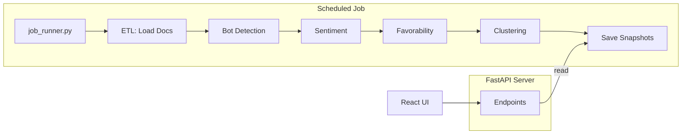

# Background Analysis Pipeline - Implementation Walkthrough

## Summary

Converted the Civic Lens analysis pipeline from on-demand API execution to scheduled background jobs that pre-compute and cache results. The API now serves static cached data for fast response times.

## Changes Made

### New Files

| File | Description |
|------|-------------|
| [cache.py](file:///c:/Users/kobey/civic-lens/analysis/src/common/cache.py) | File-based JSON cache for aggregation snapshots |
| [job_runner.py](file:///c:/Users/kobey/civic-lens/analysis/src/scheduler/job_runner.py) | Pipeline orchestrator: ETL, analysis, clustering, caching |
| [__init__.py](file:///c:/Users/kobey/civic-lens/analysis/src/scheduler/__init__.py) | Scheduler module init |
| [test_cache.py](file:///c:/Users/kobey/civic-lens/analysis/tests/test_cache.py) | Unit tests for cache module |
| [setup-scheduled-task.ps1](file:///c:/Users/kobey/civic-lens/setup-scheduled-task.ps1) | Windows Task Scheduler setup script |

### Modified Files

| File | Changes |
|------|---------|
| [server.py](file:///c:/Users/kobey/civic-lens/analysis/src/api/server.py) | Serves cached data with fallback; added `/api/cache-status` |
| [settings.py](file:///c:/Users/kobey/civic-lens/analysis/src/common/settings.py) | Added `cache_dir` config |
| [run.ps1](file:///c:/Users/kobey/civic-lens/run.ps1) | Added `analyze` command |
| [README.md](file:///c:/Users/kobey/civic-lens/README.md) | Updated workflow documentation |

---

## Architecture



---

## Usage

### Manual Trigger
```powershell
.\run.ps1 analyze
```

### Scheduled Execution
```powershell
# Set up Windows Task Scheduler (requires Admin)
.\setup-scheduled-task.ps1 -RunsPerDay 4
```

### View Cache Status
```
GET http://localhost:8000/api/cache-status
```

---

## Verification Results

### Cache Tests (10/10 passed)
```
analysis/tests/test_cache.py::TestSnapshotCache::test_save_and_load PASSED
analysis/tests/test_cache.py::TestSnapshotCache::test_load_missing_key PASSED
analysis/tests/test_cache.py::TestSnapshotCache::test_exists PASSED
analysis/tests/test_cache.py::TestSnapshotCache::test_delete PASSED
analysis/tests/test_cache.py::TestSnapshotCache::test_metadata PASSED
analysis/tests/test_cache.py::TestSnapshotCache::test_load_with_meta PASSED
analysis/tests/test_cache.py::TestSnapshotCache::test_get_all_metadata PASSED
analysis/tests/test_cache.py::TestSnapshotCache::test_clear_all PASSED
analysis/tests/test_cache.py::TestSnapshotCache::test_sanitizes_key PASSED
analysis/tests/test_cache.py::TestSnapshotCache::test_complex_data PASSED
```

### Import Tests
- `job_runner.py` imports successfully
- `server.py` imports successfully with cache integration
